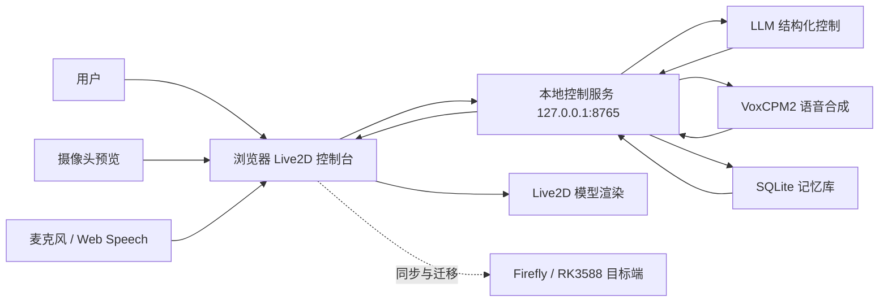

# Visual Companion Robot

基于 Firefly/RK3588 的多模态虚拟陪伴机器人项目。当前仓库以 Windows 笔记本为主要开发环境，以 Firefly 板卡为目标运行环境，围绕 Live2D 虚拟形象、连续对话、语音合成、语音识别、视觉输入和本地推理能力，构建一套可展示、可迁移、可逐步替换模型后端的端侧陪伴机器人系统。

## 作品定位

本作品面向日常聊天、情感陪伴和人机交互展示场景。系统通过摄像头、麦克风、LLM、TTS、ASR 与 Live2D 表情动作控制协同工作，让虚拟角色能够感知用户、理解输入、生成回复、合成女声语音，并以表情、动作、口型和待机行为进行拟人化反馈。

项目目前的工程重点不是简单堆 API，而是把多模态交互拆成清晰的模块边界：开发阶段可以先用 DeepSeek 与 VoxCPM 公网测试链路验证体验，迁移到 Firefly 后再逐步替换为本地模型推理。

## 当前能力

| 模块 | 当前状态 | 说明 |
| --- | --- | --- |
| Live2D 展示 | 已接入 | 使用 `Strawberry_Rabbit` 模型，支持表情、动作、口型、鼠标跟随、待机动作、拖拽定位和缩放记忆。 |
| LLM 控制 | 已接入 | 本地控制服务请求 LLM，输出结构化控制计划，并支持异常结构重试和动作计划队列。 |
| 语音合成 | 已接入 | 语音路线收敛为 VoxCPM2，保留公网 API、本地推理和临时 Gradio 桥接模式。 |
| 参考音色 | 已接入 | `main/assets/tts/voxcpm_samples/` 保存可试听参考音频及对应文本。 |
| 听觉模块 | 已接入浏览器端 | 支持选择麦克风、监听输入、实时语音转文字，并把识别文本发送给 Live2D 对话链路。 |
| 视觉模块 | 已接入浏览器端 | 支持选择摄像头、保存默认设备，并以可拖拽、可等比例缩放的小窗预览画面。 |
| 记忆模块 | 已预留并接入骨架 | 对话轮次保存到 SQLite 数据库，后续继续完善时间敏感记忆和检索策略。 |
| Firefly 同步 | 已接入脚本 | 支持把 Windows 开发目录同步到 Firefly 的 `~/wwk/Visual_Companion_Robot`。 |

## 架构概览



核心原则是“显示层不直接绑定模型细节”。浏览器舞台只负责交互、展示和设备选择；本地控制服务负责 LLM、TTS、记忆和文件配置；Firefly 迁移时优先复用同一套模块入口，减少重新接线成本。

## 目录结构

```text
Visual_Companion_Robot/
  README.md                         项目总览与开发入口
  environment.yml                   Conda 环境定义，当前统一 Python 3.11
  pyproject.toml                    Python 项目元数据
  architecture_design.md            早期总体设计记录
  tools/                            Windows/Firefly 辅助脚本
  tools/launchers/                  可双击的 Windows .bat 薄启动器
  main/                             板端与本地展示主体代码
  main/live2d_stage/                Vite Live2D 网页控制台
  main/scripts/                     控制服务、LLM、TTS 和测试脚本
  main/src/visual_companion_robot/  可复用业务模块
  main/assets/live2d/               Live2D 模型资源
  main/assets/tts/                  VoxCPM 参考音频资源
  main/config/                      应用配置、TTS 配置、嘴型配置
  main/models/voxcpm/               VoxCPM2 本地模型放置目录
  main/docs/                        架构、协议、任务和外部参考说明
  main/tests/                       Python 自动化测试
```

## 快速启动

本地 Windows 终端默认使用 PowerShell 7+ 的 `pwsh`。如果只想打开当前 Live2D 开发台，使用统一启动入口：

```bat
tools\launchers\live2d_stage.bat
```

这个菜单可以选择一键启动控制服务、Vite 网页和浏览器，也可以单独启动网页、单独启动控制服务、运行静态检查或刷新 LLM 控制文件。旧的分散网页启动脚本已经合并到这个入口，避免多进程状态不一致。

第一次配置本地 Conda 环境：

```bat
tools\launchers\setup_conda.bat
```

需要手动进入网页目录检查前端时：

```powershell
Push-Location -LiteralPath .\main\live2d_stage
npm install
npm run check
npm run dev
Pop-Location
```

## 本机配置

复制本地私有配置模板：

```powershell
Copy-Item -LiteralPath .\main\config\local.env.example -Destination .\main\config\local.env
```

`main/config/local.env` 不进入 Git，用于保存本机或 Firefly 的私有路径。VoxCPM2 本地推理默认读取：

```text
main/models/voxcpm/VoxCPM2
```

也可以在 `local.env` 中设置：

```text
VOXCPM_MODEL_PATH=E:\path\to\VoxCPM2
VOXCPM_DEVICE=auto
```

LLM 的 API key 不写入仓库。控制服务只从环境变量或本地私有配置读取敏感信息。

## 语音路线

当前 TTS 只保留 VoxCPM2 路线，配置集中在：

```text
main/config/tts_models.json
```

可用后端：

| 后端 | 用途 | 说明 |
| --- | --- | --- |
| `voxcpm_hf_space_test` | 公网 API 测试 | 调用 OpenBMB Hugging Face Space，适合开发阶段快速验证，但可能排队或限流。 |
| `voxcpm_local` | 项目内本地推理 | 直接加载 VoxCPM2，本项目迁移到 Firefly 后优先使用该模式。 |
| `voxcpm_local_gradio` | 临时桥接 | 只用于对接外部 Gradio 服务，不作为正式路线。 |

参考音频位于：

```text
main/assets/tts/voxcpm_samples/
```

这些音频用于给 VoxCPM 提供音色参考，不再作为“占位语音模型”。前端语音面板可以选择参考音频、试听参考音频并编辑参考文本。

## Live2D 控制

当前模型：

```text
main/assets/live2d/Strawberry_Rabbit/Strawberry_Rabbit.model3.json
```

模型原始热键和动作说明整理在：

```text
main/docs/live2d_model_usage.md
```

LLM 输出到 Live2D 的结构化协议见：

```text
main/docs/live2d_control_protocol.md
```

展示台支持：

| 能力 | 说明 |
| --- | --- |
| 动作盘 | 可手动触发右抬手、左抬手、麦克风、比心、游戏机、表情轮盘等模型动作。 |
| 持续动作 | LLM 可以输出 `hold`、`pulse`、`toggle` 等动作模式，并带持续时间与延迟时间。 |
| 口型同步 | 语音播放时由音频状态驱动口型，嘴型基础参数保存在 `main/config/mouth_shapes.json`。 |
| 待机表现 | 无输入时自动执行轻量待机动作，减少角色静止感。 |
| 用户调整 | 点击人物后可以调整缩放，拖拽人物可以改变位置，设置会保存在浏览器本地。 |

## 视觉与听觉

视觉模块目前基于浏览器摄像头能力实现，适合 Windows 开发阶段验证摄像头选择和画面预览。前端可以保存默认摄像头，预览窗支持拖拽和等比例缩放。

听觉模块目前基于浏览器麦克风与 Web Speech API 实现，适合快速验证“语音输入 -> 文字 -> LLM -> Live2D 回复”的闭环。后续迁移到 Firefly 时，会把浏览器端 STT 替换为本地 ASR 或板端可运行的语音识别模型。

## Firefly 工作流

Windows 是主要编辑和 Git 管理环境，Firefly 是目标运行和硬件调试环境。默认目标路径：

```text
~/wwk/Visual_Companion_Robot
```

同步项目到 Firefly：

```bat
tools\launchers\sync_firefly.bat
```

在 Firefly 上运行板端入口：

```bat
tools\launchers\run_firefly.bat
```

远程桌面和网络辅助入口：

```bat
tools\launchers\start.bat
tools\launchers\connect.bat
```

## 验证命令

前端静态检查：

```powershell
Push-Location -LiteralPath .\main\live2d_stage
npm run check
Pop-Location
```

Live2D 资源检查：

```bat
tools\launchers\test_live2d.bat
```

嘴型可视化报告：

```bat
tools\launchers\test_mouth_visual.bat
```

Python 测试可在 Conda 环境内运行：

```powershell
conda run -n visual-companion-robot python -m pytest main\tests
```

## 文档索引

| 文档 | 内容 |
| --- | --- |
| `main/docs/architecture.md` | 模块边界与板端运行架构。 |
| `main/docs/live2d_control_protocol.md` | LLM 到 Live2D 的结构化控制协议。 |
| `main/docs/live2d_model_usage.md` | Strawberry_Rabbit 模型动作、表情和热键整理。 |
| `main/docs/voxcpm_tts_route.md` | VoxCPM2 语音路线和模型接入说明。 |
| `main/docs/external_reference_assessment.md` | 外部参考项目的可借鉴性评估。 |
| `main/docs/python-runtime.md` | Python 版本、Conda 环境和本地推理约束。 |
| `main/docs/tasks.md` | 已完成任务与下一步计划。 |

## 后续路线

1. 完善记忆数据库的时间解析、事实抽取和检索策略。
2. 将听觉模块从浏览器 Web Speech API 迁移到可在 Firefly 上运行的本地 ASR。
3. 将视觉模块从预览窗升级为真实目标检测、人脸/姿态感知和情绪线索输入。
4. 优化 VoxCPM2 在 Firefly/RK3588 上的本地推理链路与启动管理。
5. 将 LLM 从公网 API 逐步替换为端侧可运行或局域网自托管模型。
6. 打磨比赛展示流程，形成“开机 -> 启动服务 -> 对话展示 -> 视觉/听觉交互”的稳定演示闭环。

## 外部参考

本项目会借鉴外部项目的架构思想，但不直接复制其实现：

| 项目 | 借鉴方向 |
| --- | --- |
| [OpenBMB/VoxCPM](https://github.com/OpenBMB/VoxCPM) | 高质量中文 TTS 与音色参考路线。 |
| [AkagawaTsurunaki/ZerolanLiveRobot](https://github.com/AkagawaTsurunaki/ZerolanLiveRobot) | Live2D 展示层与交互层解耦思路。 |
| [entropy622/LLM_Live2D](https://github.com/entropy622/LLM_Live2D) | LLM 输出结构化控制 Live2D 的方向。 |
| [soiwm/astrbot_plugin_vtuber](https://github.com/soiwm/astrbot_plugin_vtuber) | 虚拟形象口型与动作映射思路。 |

## 当前工程约束

| 约束 | 说明 |
| --- | --- |
| Python | 当前统一使用 Conda 环境 `visual-companion-robot`，Python 3.11。 |
| Node | Live2D 网页使用 Vite，依赖安装在 `main/live2d_stage/`。 |
| 模型权重 | VoxCPM2 权重不进入 Git，放在 `main/models/voxcpm/VoxCPM2` 或通过 `VOXCPM_MODEL_PATH` 指定。 |
| 运行数据 | `main/data/`、`main/reports/`、`main/config/local.env` 不进入 Git。 |
| 本地终端 | Windows 本地默认使用 PowerShell 7+ 的 `pwsh`。 |
