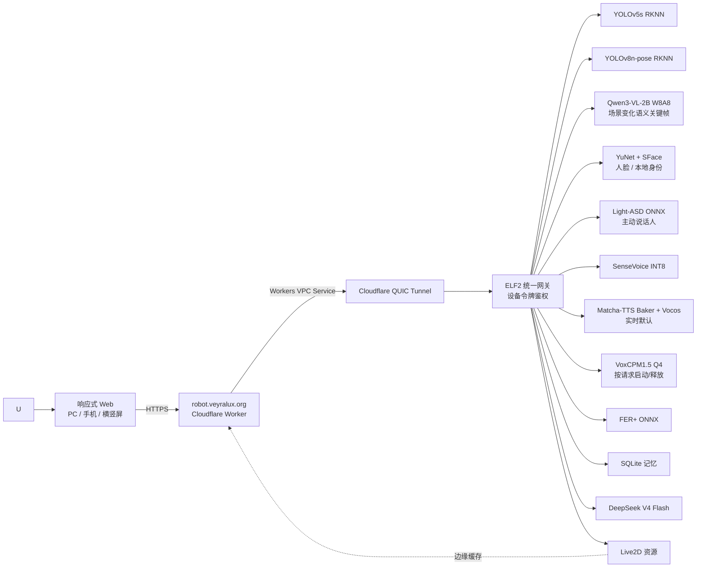

# Visual Companion Robot

基于 ELF2 (RK3588) 的说话人中心多模态 AI 陪伴机器人。它在开发板本地理解面前的人、情绪、身份与环境，把可信视觉上下文交给对话层，并驱动 Live2D 角色回应。Windows 10 仅为开发环境；响应式 Web 负责采集和呈现，ELF2 是视觉、ASR、TTS、记忆与控制中枢。

## 作品定位

本项目是一个**能认人、能察言观色、能听、能说、能演**的桌面 AI 伴侣。首要感知对象不是泛化图像标签，而是正在与角色交流的人：脸部特征、已登记身份、情绪、动作与整体状态；其次才是其周围物体和背景环境。

单帧中的“关注对象”和经过音画时序验证的“主动说话人”是两个概念。当前生产链路能在 ELF2 上检测多人、选择关注脸、匹配本地登记身份、分析情绪与姿态，并用同步的 16 kHz PCM 和连续人脸帧运行 Light-ASD；只有音画一致性达到门限时才会标记真正的主动说话人。

在线入口：[robot.veyralux.org](https://robot.veyralux.org)（PC、手机竖屏与横屏自适应）。微信小游戏保留现有开发版，但当前收尾与验收只针对 Web，不再扩展小游戏功能。

## 当前闭环架构



## 模块清单

| 模块 | 状态 | 说明 |
|------|:----:|------|
| **小游戏交互层** | ⏸️ | 保留现有 `0.3.1` 开发版；当前不继续扩展，避免与 Web 收尾并行产生两套交互实现 |
| **Web 交互层** | ✅ | Live2D 锁定最高 60 FPS，并按实际帧率动态调整渲染分辨率；移动浏览器允许无设备枚举 API 的默认摄像头/麦克风，并为无 AudioWorklet 的内核提供 PCM 兼容采集 |
| **LLM 对话** | ✅ | ELF2 网关调用 DeepSeek V4 Flash，结构化计划与连续多轮记忆已完成公网实测 |
| **Live2D 展示** | ✅ | Strawberry_Rabbit、27 个动作、口型/触摸跟随/待机已迁移；Cubism Core 5.1.0 与开发者工具渲染验收通过 |
| **动作映射** | ✅ | 80+ 关键词 + 缓存，精准映射到 27 个 Live2D 动作 |
| **场景视觉** | ✅ | YOLO/姿态/人脸约 120–360 ms 返回；Qwen3-VL-2B W8A8 + FP16 RKNN 以 32 token 异步刷新关键帧语义，实测约 4.4–5.4 秒；帧指纹和结构化检测冲突门控阻止旧场景或明显幻觉进入对话上下文 |
| **人脸与身份** | ✅ | ELF2 YuNet 检测 + SFace 特征 + 本地 SQLite 命名身份；仅保存特征向量，不保存登记照片 |
| **情绪识别** | ✅ | 每张 YuNet 人脸框在 ELF2 运行 FER+；不再依赖误报率较高的 Haar 框 |
| **主动说话人** | 🧪 | Web/小游戏已接入 2 秒 PCM + 16 帧协议；真实多人视频在 ELF2 与公网均正确确认（置信度 0.82，公网约 4.1 秒），真人连续对话阈值待验收 |
| **人体动作** | ✅ | Rockchip 官方 YOLOv8n-pose RKNN 已在 ELF2 部署；约 49–57 ms，输出骨架、举手、倾斜、站立/坐姿等保守语义 |
| **语音合成 (TTS)** | ✅ | 默认 ELF2 Matcha Baker + Vocos，公网热生成约 1.0–1.4 秒；另有板端 VoxCPM1.5 Q4 `soft_girl` 参考音色，按请求启动并在结束后释放，2.56 秒短句实测约 15–19 秒 |
| **语音识别 (ASR)** | ✅ | Web 通过同源 WebSocket 边录边传，句尾运行板端 SenseVoice；客户端 320 ms 句尾门限，服务端裁掉首尾静音后再识别，HTTP 整段上传仅作回退 |
| **语音打断 (VAD)** | ✅ | 客户端自适应噪声底线、宽带噪声门控与浏览器降噪；板端 WebRTC VAD 级别 3、8% 有效语音门限，TTS 播放期间支持高阈值抢占 |
| **记忆模块** | ✅ | SQLite 保存最近对话与显式长期记忆；姓名、生日、喜好和“请记住”内容会以有界结构加入对话上下文 |
| **消息总线** | ✅ | RobotEvent + 事件类型常量，解耦模块通信 |
| **公网链路** | ✅ | `robot.veyralux.org` → Worker → VPC Service → QUIC Tunnel → ELF2，含鉴权与 Live2D 边缘缓存 |
| **ELF2 部署** | ✅ | emotion、VLM、control、cloudflared 四项常驻 systemd 服务；VoxCPM 按请求运行，避免与 Qwen3-VL 同时长期占用 8 GiB 内存 |

## 项目结构

```text
main/
├── config/
│   ├── app.yaml                    # 双后端配置（backend/model_paths/npu）
│   └── requirements-board.txt      # RK3588 板端依赖清单
├── src/visual_companion_robot/
│   ├── integrations/               # 模型运行时 + 外部服务集成
│   │   ├── model_runtime.py        #   RknnEngine / RkllmEngine / OnnxEngine
│   │   ├── model_assets.py         #   模型安全下载与解压
│   │   ├── llm_client.py           #   LlmClient 抽象 + DeepSeek/Local 双实现
│   │   └── web_context.py          #   Open-Meteo 天气查询
│   ├── perception/                 # 感知层
│   │   ├── vision.py               #   PerceptionFrame 数据结构
│   │   ├── detector.py             #   YOLO NPU 检测器
│   │   ├── scene_analyzer.py        #   本地 YOLO 场景语义
│   │   ├── vision_service.py        #   RKNN + FER+ 统一视觉模块
│   │   ├── semantic_vlm_server.py   #   常驻 Qwen3-VL/RKLLM 语义服务
│   │   ├── face_analysis.py         #   YuNet / SFace / 本地身份库
│   │   ├── pose.py                  #   YOLOv8 Pose RKNN / 骨架语义
│   │   ├── yolo_v5.py               #   三检测头解码与 NMS
│   │   ├── emotion.py              #   FER+ ONNX 情绪识别
│   │   ├── emotion_server.py       #   人脸 / 情绪 / 主动说话人 HTTP 服务
│   │   ├── active_speaker.py       #   Light-ASD 同步音画主动说话人
│   │   ├── perception_loop.py      #   摄像头→视觉→总线 主循环
│   │   ├── asr_interface.py        #   ASR 抽象基类 + 工厂
│   │   ├── sherpa_onnx_asr.py      #   SenseVoice INT8 后端
│   │   ├── offline_asr_service.py  #   PCM16 / VAD / ASR 编排
│   │   └── vad.py                  #   WebRTC VAD 语音打断
│   ├── brain/                      # 对话决策层
│   │   ├── dialogue.py             #   DialogueContext + DialogueTurn
│   │   └── memory.py               #   SQLite 记忆存储
│   ├── speech/                     # 语音输出层
│   │   └── tts_interface.py        #   TTS 抽象基类 + 工厂
│   ├── voice/                      # 语音引擎
│   │   ├── voxcpm_cpp.py           #   ELF2 VoxCPM.cpp 按请求运行适配器
│   │   └── sherpa_tts.py          #   sherpa-onnx TTS 轻量后端
│   ├── runtime/                    # 运行时
│   │   ├── robot.py                #   RobotRuntime 闭环主循环
│   │   ├── bus.py                  #   消息总线
│   │   └── config.py               #   双后端配置加载
│   └── ui/live2d/                  # Live2D 控制
│       ├── controller.py           #   动作/表情控制
│       └── mouth_sync.py           #   口型同步
├── live2d_stage/                   # Vite Live2D 网页控制台
│   └── src/
│       ├── stage.js                #   主舞台 + 真实运行后端状态面板
│       ├── offline-asr-client.js   #   PCM 传输分段；识别与最终 VAD 在 ELF2
│       └── perception-client.js    #   摄像头 JPEG 采集与板端视觉适配
├── miniprogram/                    # 微信小游戏工程（沿用既有目录名）
│   ├── core/                       # 公网 API、音频与 Live2D 控制
│   └── game/                       # Canvas 界面、布局与交互控制器
└── tools/
    ├── download_emotion_ferplus.py # FER+ 模型下载
    ├── export_yolo_rknn.py         # YOLO ONNX → RKNN 导出
    └── integration_test.py         # 端到端集成测试
```

## 快速开始

### 开发环境 (Windows 10)

```powershell
# 1. 创建/更新环境（PowerShell 7 非必需）
tools\launchers\setup_conda.bat

# 2. 自动化回归
tools\launchers\test_live2d.bat

# 3. 启动响应式网页交互端（本地开发与回归）
tools\launchers\live2d_stage.bat
```

微信小游戏工程仍位于 `main/miniprogram`，但当前版本冻结；新功能、拟真验收和公网发布均以 `main/live2d_stage` 为准。

外部服务密钥只放在当前终端环境变量，或被 Git 忽略的
`main/config/local.env` 中；不得写入受版本控制的文件：

```powershell
$env:DEEPSEEK_API_KEY = "..."
```

### 部署环境 (ELF2 RK3588)

```bash
# 1. 安装板端依赖
pip install -r main/config/requirements-board.txt

# 2. 准备 YOLO、Pose、YuNet、SFace、FER+ 与 Light-ASD 模型
python tools/download_emotion_ferplus.py

# 3. 安装 VoxCPM.cpp 与固定 Q4 模型（模型站不可达时设置 VOXCPM_MODEL_SOURCE）
tools/board/install_voxcpm_cpp.sh

# 4. 核对生产后端
#    vision / asr / tts / vad 使用 local；llm 使用 DeepSeek Flash cloud

# 5. 启动情绪服务
python -m visual_companion_robot.perception.emotion_server &

# 6. 启动主程序
python main/app.py
```

### ELF2 上电后一键启动

四项服务已设置为 `systemd` 开机自启。电脑与开发板处于同一可互访网络时，可在 Windows
PowerShell/CMD 直接执行这一条命令；`-t` 用于显示开发板上的 `sudo` 密码提示：

```powershell
ssh -t wenkang@elf2-desktop.local "~/start-robot"
```

如果已经先执行 `ssh wenkang@elf2-desktop.local` 登录开发板，则只需输入：`~/start-robot`。
首选网络曾使用静态地址 `192.168.5.22`；手机热点通过 DHCP 分配地址，不能把该地址写死。
Windows 可用 `Resolve-DnsName elf2-desktop.local` 查询当前地址，板端可用 `hostname -I` 查看。

从 Windows 将当前 Git 提交安全同步到 ELF2、刷新服务并执行完整验收：

```powershell
tools\launchers\sync_firefly.bat -Restart
```

同步会保留板端 `.venv`、模型、SQLite 数据及私有 `board.env`，不会把 Windows 的密钥、缓存或未提交文件传入开发板。

当前手机热点配置为上电自动连接且优先级高于已失去互联网的旧网络。该 ELF2 镜像的
AX200 在默认区域码下未发现 5 GHz 信道 149；手机热点应启用 2.4 GHz 兼容模式。

脚本会先确认 VoxCPM 二进制已安装，刷新仓库中的四个 systemd 单元，清理旧常驻 Vox 进程，再幂等启动并自检 `visual-companion-emotion`、`visual-companion-vlm`、`visual-companion-control` 与 `visual-companion-cloudflared`。VoxCPM 由控制网关在请求期间启动，不作为第五个常驻服务；Cloudflare Tunnel 只依赖网络，即使控制服务重启也会保持连接。需要主动重启或查看状态时：

```powershell
ssh -t wenkang@elf2-desktop.local "~/start-robot restart"
ssh -t wenkang@elf2-desktop.local "~/start-robot status"
# 部署完成后的强校验
ssh wenkang@elf2-desktop.local "cd ~/embedded_competition && tools/board/verify_deployment.sh"
```

## 技术栈

| 层 | 技术 |
|------|------|
| **后端语言** | Windows Python 3.11；ELF2 出厂 Python 3.10 |
| **NPU 推理** | rknn-toolkit-lite2 2.1.0 + YOLO/Pose RKNN；隔离的 RKLLM 1.2.3 + Qwen3-VL-2B W8A8 |
| **CPU 推理** | OpenCV DNN (YuNet/SFace), onnxruntime (FER+ / Light-ASD) |
| **语音** | sherpa-onnx SenseVoice / Matcha + Vocos、webrtcvad、VoxCPM.cpp + VoxCPM1.5 Q4 |
| **前端** | 微信小游戏 Canvas + Pixi 适配层 + Live2D Cubism；Vite 响应式 Web 端同步支持 PC 与移动浏览器 |
| **公网入口** | Cloudflare Worker + Workers VPC Service + Cloudflare Tunnel |
| **云端** | DeepSeek V4 Flash, Open-Meteo API |
| **硬件** | ELF2 (RK3588, 6 TOPS NPU) |

生产默认边界：对话规划使用 DeepSeek Flash；ASR、TTS、VAD、YOLO、Pose、Qwen3-VL、YuNet、SFace、FER+、Light-ASD 与记忆均在 ELF2 运行，客户端只负责采集和呈现。公网入口只转发到自有板端服务，不把视觉、身份特征、音频或 TTS 请求转交第三方模型服务。

## 主要接口

| 接口 | 输入 | ELF2 本地处理 |
|------|------|---------------|
| `POST /vision` | 单张压缩 JPEG | 实时目标/姿态/人脸/身份/情绪 + 异步缓存的 Qwen3-VL 场景语义 |
| `POST /active-speaker` | 最后 2 秒 PCM16 + 最后 16 帧 | 人脸短时跟踪与 Light-ASD 音画一致性 |
| `GET /realtime` | WebSocket PCM16 小块或 JPEG 帧 | ASR 边录边传；Web/小游戏连续视觉复用长连接。生产同帧实测视觉 HTTP 平均约 980 ms、WSS 平均约 593 ms |
| `POST /asr` | 16 kHz PCM16 | 整段识别兼容/回退路径 |
| `POST /tts` | 文本、语速、音色与参考音色 | Matcha 实时合成，或按请求运行 VoxCPM.cpp 参考音色 |
| `POST /chat` | 文本 + 已净化视觉上下文 | 记忆编排、DeepSeek Flash 与 Live2D 控制计划 |

## 后续路线

1. 在现有 YOLOv8n-pose 单帧骨架上增加短时跟踪，稳定站立、坐下、俯身和转身状态
2. 用真人连续对话复核 SenseVoice、FER+、SFace、Light-ASD 与 TTS 抢占阈值
3. 若以后恢复小游戏方向，再单独完成微信平台隐私声明、合法域名与审核，不与 Web 主线耦合
