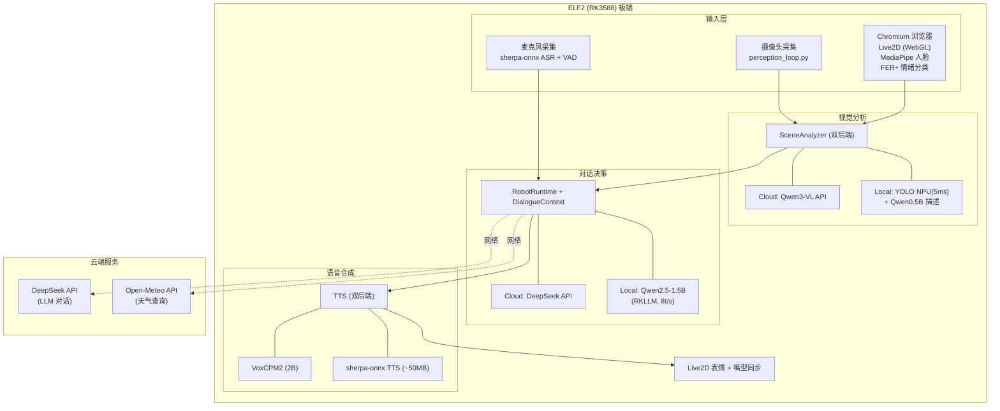

# Visual Companion Robot

基于 ELF2 (RK3588) 的多模态 AI 陪伴机器人。透过摄像头感知用户场景，结合 LLM 生成带情绪的个性化回复，驱动 Live2D 虚拟形象做出匹配的表情动作。Windows 10 为开发环境，ELF2 板卡为目标运行环境。

## 作品定位

本项目是一个**能看、能听、能说、能演**的桌面 AI 伴侣。它通过摄像头实时理解用户所在的场景和活动，将视觉上下文注入 LLM 对话，生成符合角色人设的回复，并自动映射为 Live2D 表情动作播放。

不再是"你说一句我回一句"的聊天机器人，而是会主动观察、会察言观色、会用动作表达情绪的虚拟伙伴。

## 闭环架构



## 模块清单

| 模块 | 状态 | 说明 |
|------|:----:|------|
| **视觉感知** | ✅ | 双后端：云端 Qwen3-VL-8B API / 本地 YOLOv26N NPU (5ms) + Qwen0.5B 描述 |
| **LLM 对话** | ✅ | 双后端：云端 DeepSeek-V3 API / 本地 Qwen2.5-1.5B (RKLLM, 8t/s) |
| **Live2D 展示** | ✅ | Strawberry_Rabbit 模型，表情/动作/口型/鼠标跟随/待机/拖拽缩放 |
| **动作映射** | ✅ | 80+ 关键词 + 缓存，精准映射到 27 个 Live2D 动作 |
| **情绪识别** | ✅ | FER+ ONNX (Microsoft Model Zoo)，后端 HTTP 服务，<5ms/次 |
| **语音合成 (TTS)** | ✅ | 双后端：VoxCPM2 (2B) / sherpa-onnx TTS (~50MB) |
| **语音识别 (ASR)** | ⚙️ | sherpa-onnx 后端已实现，待接入麦克风 |
| **语音打断 (VAD)** | ✅ | WebRTC VAD (webrtcvad)，去掉 PyTorch 依赖 |
| **记忆模块** | ✅ | SQLite 对话轮次存储，DialogueContext 维护视觉+对话上下文 |
| **消息总线** | ✅ | RobotEvent + 事件类型常量，解耦模块通信 |
| **ELF2 部署** | ⚙️ | 配置就绪，待板端安装依赖 |

## 项目结构

```text
main/
├── config/
│   ├── app.yaml                    # 双后端配置（backend/model_paths/npu）
│   └── requirements-board.txt      # RK3588 板端依赖清单
├── src/visual_companion_robot/
│   ├── integrations/               # 模型运行时 + 外部服务集成
│   │   ├── model_runtime.py        #   RknnEngine / RkllmEngine / OnnxEngine
│   │   ├── llm_client.py           #   LlmClient 抽象 + DeepSeek/Local 双实现
│   │   └── web_context.py          #   Open-Meteo 天气查询
│   ├── perception/                 # 感知层
│   │   ├── vision.py               #   PerceptionFrame 数据结构
│   │   ├── detector.py             #   YOLO NPU 检测器
│   │   ├── scene_analyzer.py        #   双后端场景分析器
│   │   ├── emotion.py              #   FER+ ONNX 情绪识别
│   │   ├── emotion_server.py       #   情绪推理 HTTP 服务
│   │   ├── perception_loop.py      #   摄像头→视觉→总线 主循环
│   │   ├── asr_interface.py        #   ASR 抽象基类 + 工厂
│   │   ├── sherpa_onnx_asr.py      #   sherpa-onnx ASR 后端
│   │   └── vad.py                  #   WebRTC VAD 语音打断
│   ├── brain/                      # 对话决策层
│   │   ├── dialogue.py             #   DialogueContext + DialogueTurn
│   │   └── memory.py               #   SQLite 记忆存储
│   ├── speech/                     # 语音输出层
│   │   └── tts_interface.py        #   TTS 抽象基类 + 工厂
│   ├── voice/                      # 语音引擎
│   │   ├── voxcpm_local.py         #   VoxCPM2 本地推理
│   │   └── sherpa_tts.py          #   sherpa-onnx TTS 轻量后端
│   ├── runtime/                    # 运行时
│   │   ├── robot.py                #   RobotRuntime 闭环主循环
│   │   ├── bus.py                  #   消息总线
│   │   └── config.py               #   双后端配置加载
│   └── ui/live2d/                  # Live2D 控制
│       ├── controller.py           #   动作/表情控制
│       └── mouth_sync.py           #   口型同步
├── live2d_stage/                   # Vite Live2D 网页控制台
│   └── src/
│       ├── stage.js                #   主舞台 + 推理后端面板
│       ├── emotion-onnx-client.js  #   情绪分类（调用后端 FER+）
│       └── perception-client.js    #   MediaPipe 人脸追踪
└── tools/
    ├── download_emotion_ferplus.py # FER+ 模型下载
    ├── export_yolo_rknn.py         # YOLO ONNX → RKNN 导出
    └── integration_test.py         # 端到端集成测试
```

## 快速开始

### 开发环境 (Windows 10)

```powershell
# 1. 环境
conda activate companion

# 2. 密钥
set SILICONFLOW_KEY=sk-your-key-here

# 3. 配置后端（开发机用 cloud）
#    main/config/app.yaml 中 backend 全设为 cloud

# 4. 测试闭环
python -c "
import sys; sys.path.insert(0,'main/src')
from visual_companion_robot.runtime.robot import RobotRuntime, RobotConfig
from visual_companion_robot.integrations.llm_client import create_llm_client
llm = create_llm_client(backend='cloud', api_key='sk-xxx')
rt = RobotRuntime(RobotConfig(debug=True), llm_client=llm)
resp = rt.run_once('你好！')
print(resp.display_text)
print(resp.emotion, resp.actions)
"
```

### 部署环境 (ELF2 RK3588)

```bash
# 1. 安装板端依赖
pip install -r main/config/requirements-board.txt

# 2. 下载模型
python tools/download_emotion_ferplus.py

# 3. 配置本地后端
#    main/config/app.yaml 中 backend 设为 local

# 4. 启动情绪服务
python -m visual_companion_robot.perception.emotion_server &

# 5. 启动主程序
python main/app.py
```

## 技术栈

| 层 | 技术 |
|------|------|
| **后端语言** | Python 3.11 |
| **NPU 推理** | rknn-toolkit2 (YOLO) |
| **CPU 推理** | llama-cpp-python (Qwen2.5), onnxruntime (FER+) |
| **语音** | sherpa-onnx (ASR/TTS), webrtcvad (VAD) |
| **前端** | Vite 8 + PixiJS 6 + Live2D Cubism |
| **浏览器 AI** | MediaPipe Tasks-Vision (人脸) |
| **云端** | DeepSeek API, 硅基流动 API, Open-Meteo API |
| **硬件** | ELF2 (RK3588, 6 TOPS NPU) |

## 后续路线

1. 接入麦克风 → VAD → ASR 语音输入闭环
2. TTS 播放集成 → 口型同步
3. Live2D 前端接收 RobotResponse 动作/情绪
4. 人脸身份注册与识别
