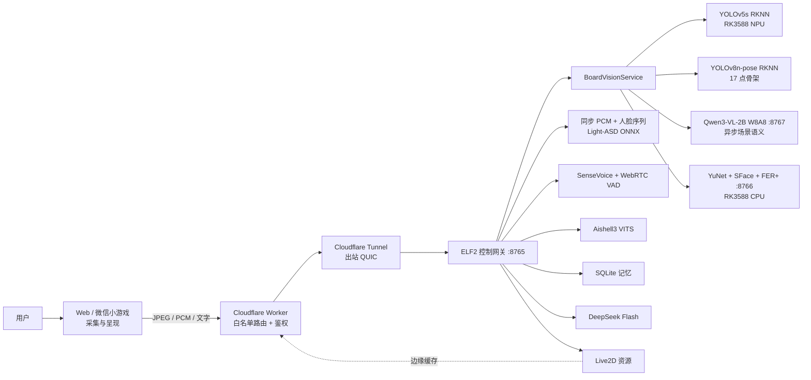

# Visual Companion Robot 生产架构

本文是 2026-07-07 起的权威架构说明。代码、部署脚本或其他文档与本文冲突时，
应先修正冲突，不能悄悄增加云端或客户端推理降级。

## 1. 不可破坏的运行边界

1. Web 与微信小游戏只负责采集摄像头、麦克风和文字，以及 Live2D 渲染和音频播放。
2. YOLO、YOLOv8 Pose、Qwen3-VL、YuNet、SFace、FER+、Light-ASD、SenseVoice、VITS、WebRTC VAD、记忆和控制编排均运行在 ELF2。
3. DeepSeek Flash 是唯一有意使用的云端模型，用于对话与动作计划。
4. Cloudflare Worker 只做静态资源、路由、设备令牌注入和错误隔离，不执行 AI 推理。
5. 本地模型缺失或初始化失败时部署失败；不得切换到浏览器、云视觉或 ONNX CPU 视觉。

## 2. 核心模块与接口

### 2.1 `BoardVisionService`

这是场景视觉链路的深模块，HTTP 层只需要学习 `load()`、`health()`、`analyze()`、
`close()` 四个操作。实现内部负责：

- Base64、大小、格式和像素数校验；
- 单例 RKNN 模型生命周期；
- 单路 NPU 推理锁和 5 秒排队上限；
- YOLOv5 三检测头解码、按类别 NMS 和中文场景描述；
- 后台调度 Qwen3-VL 关键帧语义，实时检测不等待生成式推理；
- 通过回环地址组合 YuNet 多人脸、SFace 命名身份与 FER+ 结果；
- 返回统一、可直接进入对话上下文的数据结构。

生产接口：

| 方法 | 路径 | 语义 |
| --- | --- | --- |
| GET | `/vision-health` | YOLO、FER+ 与 Qwen3-VL 都健康时才返回 `ok: true` |
| POST | `/vision` | 输入 `{image: base64}`，输出实时结构化视觉和异步缓存的场景语义 |
| POST | `/active-speaker` | 输入 16 kHz PCM16 Base64 与 4–40 帧；生产客户端发送最后 2 秒、最多 16 帧 |
| POST | `/chat` | `vision` 字段只接收经过裁剪和类型收紧的视觉上下文 |

`/emotion` 暂时保留为旧接口兼容面，但当前 Web 与小游戏不再调用它。身份登记接口只在
设备令牌保护的本地管理面开放，不加入 Cloudflare 公网白名单。

### 2.2 说话人中心语义

- `faces`：YuNet 检出的最多五张脸；每张脸分别运行 FER+ 与 SFace。
- `focus_face`：根据脸框面积和画面中心度选择的交互关注对象，仅代表“优先观察谁”。
- `profile_id/name`：只有与 ELF2 本地登记特征匹配时返回；陌生人保持空值。
- `active_speaker`：静态 `/vision` 必须返回 `unknown`。只有同步音频和连续人脸帧经过
  Light-ASD 后才允许返回 `confirmed`。

因此单人居中、嘴巴张开或“检测到声音”等启发式都不能冒充主动说话人识别。

### 2.3 客户端视觉适配器

- Web：从 `<video>` 编码最大宽度 480 的 JPEG；上一请求结束 40 ms 后立即取最新帧，
  采用单请求背压而不是堆积并发旧帧。
- 微信小游戏：使用小游戏专用 `wx.createCamera` 和 `Camera.takePhoto("low")`，
  同样在上一请求结束后取最新帧；不使用依赖 WXML `camera` 组件的 `wx.createCameraContext`。
- 两端只接受 `backend=elf2-local-yolo-pose-yunet-sface-ferplus`，不会接受浏览器或云端结果。
- 视觉上下文超过 15 秒会标记为 `stale`，不会伪装成最新观测。
- 语音句段开始时两端以约 8 fps 采集短时压缩画面；结束后把最后 2 秒 PCM 与最后 16 帧交给
  `/active-speaker`。结果保留 10 秒，避免下一次静态 `/vision` 的 `unknown` 覆盖刚确认的说话人。

### 2.4 音频链路

客户端的能量检测仅用于把连续采集流切成可传输的有限 PCM 请求；最终语音有效性由
ELF2 `OfflineAsrService` 内的 WebRTC VAD 决定，文字由 SenseVoice 生成。客户端不运行
ASR、TTS 或情绪模型。

### 2.5 60 FPS 渲染边界

- Web 与小游戏的 Live2D 循环均以 `requestAnimationFrame` 驱动并封顶 60 FPS；头部跟随与
  口型插值按真实 `deltaMs` 计算，不因设备掉到 30 FPS 而减慢一半。
- Web 按 2 秒窗口测量实际帧率；低于 50 FPS 时逐级降低设备像素比，恢复到 58 FPS 以上再
  逐级提高，优先保持动作连续性而不是盲目维持高分辨率。
- 小游戏把同一帧内的多次状态修改合并为一次 UI 重绘，Live2D 渲染和网络视觉请求互不等待。
- “60 FPS”指本地角色渲染目标。完整场景 + 姿态 + 身份 + 情绪推理受到板端算力和公网延迟
  限制，通过最新帧背压提升时效，不能虚报为 60 次完整语义推理/秒。

## 3. 生命周期与失败语义

- `visual-companion-emotion.service` 必须先加载 YuNet、SFace 与 FER+。
- `visual-companion-vlm.service` 常驻 Qwen3-VL，并设置 `MemoryHigh=3600M`、`MemoryMax=4200M`。
- `visual-companion-control.service` 启动时同步加载 RKNN，并探测 FER+；任一失败则退出，
  同时等待 VLM 健康；任一失败则退出，由 systemd 重启，而不是带病对外提供“部分视觉”。
- 控制服务设置 `MemoryHigh=2500M`、`MemoryMax=3500M`，防止异常模型吞掉整机内存。
- `/vision` 只允许一帧进入组合推理；排队超过 5 秒返回 429，客户端下一周期仍走同一
  本地接口重试。
- `/active-speaker` 只允许一个完整音画任务占用 Light-ASD；并发请求直接返回 429，避免线程
  堆积放大内存和延迟。
- 客户端进入后台立即释放摄像头和麦克风；异步结果用 generation 隔离，旧请求不能污染
  新会话。
- Cloudflare 只允许显式列出的路径，设备令牌由 Worker 覆盖注入，浏览器包中没有密钥。

## 4. 已实测资源预算

ELF2 为 RK3588、8 GiB 共享 DRAM，没有独立显存。

| 指标 | 2026-07-05 实测 |
| --- | ---: |
| 可用内存 | 6.7 GiB |
| 系统当前使用 | 约 870 MiB |
| YOLO 独立测试峰值 RSS | 约 241 MiB |
| YOLO 热推理平均 | 27.98 ms |
| 统一 `/vision` 板端实测（含人脸） | 约 176–327 ms |
| YuNet 单帧 | 约 21–65 ms |
| SFace 单张脸 | 约 26–80 ms |
| YOLOv8n-pose 单帧 | 约 49–57 ms |
| Qwen3-VL-2B 32 token 单帧 | 约 4.4–5.4 秒（后台异步） |
| Qwen3-VL 常驻 RSS | 约 2.8 GiB |
| Qwen3-VL + 控制服务运行后可用内存 | 约 3.0 GiB |
| Light-ASD 2 秒片段 | 约 283 ms；进程峰值约 315 MiB |
| 真实多人视频，公网 `/active-speaker` | 16 帧 / 146 KiB，约 4.1 秒，置信度 0.82 |
| 磁盘剩余 | 13 GiB |
| SoC/NPU 温度 | 约 40–42 ℃ |

连续结构化视觉使用严格单请求背压，实际频率由公网往返和约 0.12–0.36 秒的板端检测链路
共同决定；Qwen3-VL 每 6 秒异步刷新，不阻塞这些响应。60 FPS 只属于角色渲染，不能等同于
60 次完整推理/秒。当前 2B VLM 已通过实机内存预算；继续加入 GGUF LLM 或第二个常驻大模型前
仍必须重新测量峰值，不能消耗剩余的系统安全余量。

## 5. 并发模型

当前产品是一块实体开发板对应一个陪伴角色，不是公共推理 SaaS：

- NPU 场景推理串行，避免 RKNN 线程安全和内存峰值问题；
- Qwen3-VL 只保留一个后台任务，换景不会堆积旧关键帧；
- LLM 控制计划串行，防止不同用户交叉控制同一角色；
- ASR、TTS 有各自的模型锁；
- Light-ASD 按完整请求非阻塞串行，繁忙时返回 429；
- 上线前应保持会话所有权与边缘限流。若未来需要多个独立用户，必须增加多板调度或
  会话队列，不能靠提高单板并发掩盖实体资源冲突。

## 6. 部署门禁

一次可发布部署必须同时满足：

1. Python 全量测试、小游戏测试与静态包检查、Web 测试/检查/build、Worker TypeScript
   检查全部通过。
2. ELF2 `/vision-health` 返回本地 RKNN + FER+ 已加载。
3. 使用真人脸、多人、动物与背景图片调用板内 `/vision`，人脸与物体结果符合样例。
4. 通过 `https://robot.veyralux.org/vision` 重复同一真实图片，并用带真实音轨的多人视频测试 `/active-speaker`。
5. 公网 Web 在 PC、手机竖屏和手机横屏无水平溢出，Live2D、气泡和输入区不重叠。
6. 小游戏开发者工具编译、预览和上传成功；真机摄像头授权仍需发布前人工确认。
7. 连续运行测试期间无 OOM、持续内存增长、服务重启循环和 Tunnel 断连。

## 7. 当前限制

- Qwen3-VL 是关键帧描述器，不是逐帧开放问答；专用检测结果仍优先于生成式描述。
- FER+ 的分类准确率仍受侧脸、遮挡和极端光照影响；现在由 YuNet 提供脸框，但仍需真人样本调阈值。
- 场景视觉持续处理最新 JPEG，但严格保持一个在途请求；主动说话人使用独立 2 秒/16 帧同步音画窗口。该链路已进入
  生产并通过真实多人视频，但最终阈值仍需真人在距离、侧脸、遮挡、回声等条件下调校。
- YOLOv8n-pose 当前只输出单帧可支持的保守姿态；跌倒、持续走动等时序动作仍需连续骨架跟踪，不能由一帧下结论。
- 单板和单 Tunnel 是可用性单点；比赛/个人设备场景可接受，商业多用户需要第二块板或
  明确的离线提示与维护窗口。
