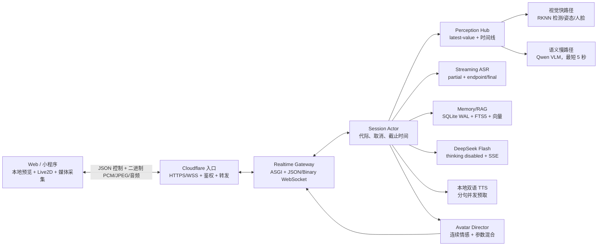

# VeyraSoul V2 架构

> 本文同时描述“目标生产架构”和“当前已经落地的纵向链路”。标为目标的模块不能当作已经部署或达到性能指标。

## 1. 为什么不继续修补 V1

V1 已证明 RK3588 本地视觉、ASR、TTS、Cloudflare 公网入口和 Live2D 可以连通，但存在系统级瓶颈：

- 前端媒体、网络、Live2D、日志和设备设置共享大块状态，优化容易产生交叉回归；
- 同一会话缺少严格的任务所有权、代际和取消语义；
- 记忆偏向最近若干轮，没有可检索的情节/事实层、冲突修订和来源置信度；
- 视觉快慢路径与对话上下文没有统一的新鲜度约束，容易引用旧语义；
- 文本、语音、动作采用整轮串行等待，用户会感到明显“停顿后突然回复”。

因此 V2 使用独立目录、显式端口和新协议，只迁移经过验证的模型资源。

## 2. 目标生产架构



完整 Perception Hub、生产环境切换和长时间服务验收仍属于后续阶段；Cubism 真实模型驱动与 V2 systemd/Cloudflare 部署骨架已经进入代码。

### 2.1 模态 Port/API 边界

V2 不以“换模型时改编排代码”为扩展方式。每个模态只有一个稳定核心契约，具体本地/云端供应商由组合根注入：

| 模态/边界 | 稳定契约 | 当前实现 | 可替换位置 |
| --- | --- | --- | --- |
| LLM | `StreamingLlm.stream_reply(messages)` | DeepSeek SSE，thinking disabled | 新增本地/云端 adapter 后在 `gateway/__main__.py` 组合，不改 TurnService |
| TTS | `SpeechSynthesizer.synthesize(SpeechSynthesisRequest)` | sherpa-onnx Kokoro/Matcha/VITS；显式 `voice_id` | 本地 sidecar 或云 TTS adapter；Vox/SoulX 只能用户主动选择 |
| ASR | `StreamingAsrFactory/Session` | sherpa-onnx streaming | 浏览器/云 ASR adapter 仍须输出相同 partial/final 契约 |
| 语义视觉 | `VisionAnalyzer.analyze(VisualFrame)` | 板内 HTTP `/analyze` adapter | RKNN/VLM 进程或云视觉 adapter；必须遵守数据出境策略 |
| 摄像头/麦克风传输 | VSR2 binary kinds 1/2 | WebSocket PCM16/JPEG | WebRTC/WebTransport 仍须保留 sequence、timestamp、generation |
| 角色表现 | `avatar.intent` + 浏览器 capability 层 | SignalMixer + AvatarActionScheduler | 替换 Live2D/3D 渲染器时不暴露模型资产名到服务端 |
| 个性化 | `AnimaProfileRepository` + settings events | 每 User/Anima SQLite + `Anima.md` | 远端配置库 adapter 必须保持 owner scope 与 revision |

记忆/RAG 当前仍是进程内 `MemoryStore/HybridRetriever` 组合，不属于感知模态，但同样受 User/Anima 物理分库约束。未来拆进独立服务时先抽 Repository Port，不让远端路径或租户 ID 由客户端自由指定。

## 3. 当前可运行纵向链路

```mermaid
sequenceDiagram
  participant B as Browser
  participant G as ASGI Gateway
  participant A as Streaming ASR
  participant K as SessionKernel
  participant M as Memory/RAG
  participant L as DeepSeek SSE
  participant T as sherpa-onnx TTS

  B->>G: 20 ms PCM16 binary frame
  G->>A: bounded queue
  A-->>B: asr.partial
  A-->>G: asr.final
  G->>K: begin_turn / generation++
  K->>M: recent turns + bounded retrieval
  K->>L: stable prefix + dynamic context
  L-->>G: streamed text delta
  G->>T: one completed sentence
  T-->>G: complete WAV for sentence
  G-->>B: audio binary frame
  G-->>B: reply.segment.ready(audioSeq, text)
  B->>B: enqueue audio; on playback start expose text
```

当前限制：

- ASR/TTS 适配器需要 ELF2 真实模型验证；
- 当前 TTS 是**逐句串行、整段 WAV 完成后发送**，还不是声学模型流式分块，也没有下一句并发预取；
- DeepSeek 和 Local VLM 已使用进程级可复用 `httpx.AsyncClient`，ASGI lifespan 会关闭连接池；仍需实测连接复用、上游断流和取消延迟；
- 自动打断目前在新 final/新文本轮或显式取消时生效，尚未用 VAD `speech_started` 提前停止旧音频；
- 视频 JPEG 已进入 5 秒 latest-value 语义调度器，并调用板内 VLM HTTP 接口；仓库尚不包含实际 RK3588 VLM worker，也没有 RKNN 快路径和场景变化触发。

## 4. 会话所有权与可取消代际

每个会话由 `SessionKernel` 保存递增的 `generation`。开始新轮、显式取消或断开连接都会推进 generation；只有仍匹配当前 generation 的任务可以：

- 向客户端发送有效回复片段；
- 提交完整对话到记忆；
- 触发后续动作或情绪变化。

浏览器也保存当前 generation。旧 generation 的音频和 `reply.segment.ready` 被丢弃；开始新轮时清空本地播放队列。该机制解决的是“旧回答复活”，不是简单依赖 HTTP 请求先后顺序。

当前 `TurnController` 使用 `asyncio.Task.cancel()` 取消编排任务；适配器仍需继续补齐主动关闭上游 HTTP 流、模型推理和 TTS 工作线程的资源回收验证。

## 5. 感知架构与频率分层

### 5.1 本地预览（用户视觉反馈）

- 浏览器 `getUserMedia` 请求 1280×720、最高 60 FPS；
- 原生 `<video>` 直接播放 `MediaStream`，不经过网络、JPEG 编码或 Preact 逐帧重渲染；
- 60 FPS 是请求目标，实际值由摄像头、浏览器和设备协商，必须读取 track settings 并实测帧率才能判定达标。

### 5.2 关键帧上传（机器视觉输入）

- 当前前端每 500 ms 采样一次，即目标 2 Hz；
- 最大宽度 384，JPEG quality 0.56；优先 `OffscreenCanvas`，否则复用单个 canvas；
- 采样在 idle 时段进行且有 busy 门，禁止并发编码；
- latest-value 语义要求是新帧覆盖旧帧，不积压摄像头历史。

### 5.3 语义慢路径（调度/适配已实现，真实模型待验证）

- 当前 `VisualSemanticScheduler` 使用容量为 1 的帧槽；等待 5 秒预算时持续替换为最新帧；
- 当前 `LocalVlmClient` 复用 HTTP client，向板内 `VEYRASOUL_VLM_URL/analyze` 发送 Base64 JPEG，并把 `semantic_caption` 转为 `VisualSnapshot`；
- 当前每个 WebSocket session 有独立 scheduler，但所有 session 共享 VLM client 的单实例推理锁，避免板内 worker 隐式形成并发长队；
- 目标快路径 2–5 Hz：RKNN 人物/物体、姿态、人脸与表情证据，尚未实现；
- 目标场景签名变化触发尚未实现；目前只有固定最短间隔；
- “5 秒”指**语义更新节流**，不是摄像头预览帧率，也不是让前端每 5 秒才看到一帧；
- 新语义结果携带 `frame_id / observed_at / completed_at`，只有满足新鲜度和帧关联条件的快照进入每轮上下文；
- 无论用户是否直接询问画面，只要快照新鲜，视觉摘要都位于动态上下文中。

Gateway 已把语义结果发布到 `LatestValue[VisualSnapshot]` 和前端 `perception.snapshot`。`ContextAssembler` 最多接受 8 秒前观察到的快照，因此默认 5 秒刷新仍有约 3 秒容错。实际 VLM worker、模型加载、输出准确度和多会话排队仍需板端闭环验证。

## 6. ASR、LLM、TTS 与同步策略

### ASR

- 浏览器 AudioWorklet 输出 16 kHz、mono、PCM16，每帧 320 samples（20 ms）；
- `SherpaStreamingAsr` 使用有界队列和后台线程解码，避免阻塞 WebSocket event loop；
- partial 仅用于监听反馈，endpoint final 才开始 LLM 轮次；
- 当前尚未接入 SenseVoice final 二次校正，也尚未完成噪声、口音和中英混合真机评测。

### LLM

- DeepSeek 使用 SSE、`stream: true`、`thinking: {type: disabled}`；
- 稳定角色 prompt 在前，动态视觉/记忆/情绪在最后一个 user message 中，有利于完全相同前缀缓存；
- 最近 8 轮、最多 8 条检索记忆和当前感知共同形成有界上下文；
- RAG 超过 80 ms 会放弃本轮检索而不是拖慢整轮回复。

### TTS 与呈现

- LLM delta 先按中文/英文标点或长度切成自然短句；
- 当前每句等待本地 TTS 生成完整 WAV；
- Gateway 按 WebSocket 顺序先发 `kind=3` 音频，再发引用其 `audioSeq` 的 `reply.segment.ready`；
- 浏览器拿到二者后排入播放队列，并在该音频真正 `play()` 时才发布配对文本；
- 新代际或取消会停止旧播放队列并清除未配对音频。

这保证“文字不领先声音”，但首句时延仍受 LLM 首句和完整句 TTS 支配。下一阶段需要首句长度自适应、TTS 分块/预取以及真实板端基准。

## 7. 记忆与 RAG

目标记忆层：感知工作集、会话工作记忆、情节记忆、人物/事实档案、文档知识 RAG。

当前已实现：

- SQLite WAL 作为单一事实源；
- 匿名 session hint 派生稳定但不可作为认证的 UserId；每个 User/Anima 物理分库、路径使用哈希 key，程序目录和 `VEYRASOUL_DATA_ROOT` 分离；
- 每个 Anima 的 `Anima.md`、回复上限/延迟/音色与 revision 持久化；旧共享库只按同 session 幂等迁移 turns，不猜测全局 facts 的所有者；
- FTS5 trigram 词法候选；
- 可选向量候选及 RRF/重要度/时间融合；
- 同一 `subject + predicate` 的 revision 历史和单一 active 值；
- 最近 8 轮恢复、取消代际禁止错误写入；
- 个人规模基准脚本和 JSON 结果。

已实现 `MemoryCurator`：按 explicit/document/conversation/inference/vision 来源可靠度折算有效置信度；相同事实规范化去重并强化；弱来源冲突只写 `fact_evidence`，不覆盖可靠记忆；明确用户纠正或更强证据生成可追溯 revision。提示元数据中的来源最多保留 16 项，完整 provenance 留在证据表。

尚未实现：可信账号认证/Auth Resolver、匿名身份升级、本地 embedding 模型适配器、文档切分/导入管线、LLM/端侧事实抽取器、自动情节摘要与长期 evidence 压缩。详见 [`user-data-isolation.md`](user-data-isolation.md)。

## 8. Live2D“生命感”系统

`Live2DStageController` 已使用本地 Cubism/Pixi runtime 加载真实 Strawberry_Rabbit 模型；桌面使用 4096 纹理，粗指针、窄屏、低内存或受限纹理设备使用 1024 纹理。`SignalMixer` 在 60 FPS ticker 中合成呼吸、眨眼、微头动、平滑注视、情感到眼睛/微笑的连续映射。播放器从实际 WAV PCM 生成 20 ms RMS 包络，并按 `audio.currentTime` 驱动嘴形；加载失败保留轻量回退角色。

后端会把明确用户情感自述与新鲜面部情绪作为弱证据，更新连续 valence/arousal/dominance/affinity/trust，并按真实单调时钟衰减。`AvatarDirector` 在 listening/thinking/speaking/idle 阶段生成渲染中立意图；`avatar.intent` 绑定 session/turn/generation/segmentIndex，前端再次按 sessionId + generation + seq 拒绝旧代与乱序事件。实际 WAV RMS 在口型混合中高于合成 speaking 波形。

浏览器原生 `AvatarActionScheduler` 已在 capability allowlist 内调用 Strawberry Rabbit 的真实 expression/motion API，按优先级、持续时间、冷却和抢占管理离散动作，并与 generation/seq 同生命周期。连续 SignalMixer 在 Live2D `beforeModelUpdate` 阶段于 motion/expression 后写入，使 RMS 口型保持最终所有权。静态能力表已与当前 model3 资源核对；自动 manifest 生成、全资产视觉回归和目标手机帧耗仍待完成。

面向用户的动作盘已经移除。浏览器当前以 `@use-gesture/vanilla` 统一鼠标、触摸、手写笔和键盘入口，通过 model3 HitArea 将指针转换成 `face`、`ear.left`、`hand.right` 等稳定语义，再由本地 `InteractionDirector` 生成可衰减的短时反射。区域后缀表示舞台画面中的视觉左右，不是角色解剖学左右；原始坐标和轨迹不进入 WebSocket、对话或记忆。该纵切片目前处于本机实现、单元测试和运行时边界核验阶段，尚未完成真实手机触控、无障碍、误触率或生产性能验收。详见 [`live2d-interaction.md`](live2d-interaction.md)。

V2 仍禁止部署或切换到 ELF2/公网评审链路。Cubism/Pixi 等运行库许可证不等于 Strawberry Rabbit 模型与美术的公开再分发许可；在模型授权证据闭环前，不得把当前资产状态描述为可公开发布。

仍待完成的表现增强包括：

- 从 model setting 读取 lip-sync/eye-blink 参数，而非硬编码单一嘴参数；
- 继续核验生命、注意、情绪、话语、手势和打断层的逐参数所有权与真机帧耗；
- 各动作声明参数所有权，防止 motion 互相覆盖；
- 音素级 viseme、说话人视线和语义重音与动作时间轴对齐；
- 用户开口立即转入倾听姿态，而非等待 ASR final。

真实 Cubism 加载已在桌面、移动竖屏和移动横屏 Chromium 自动化环境通过；目标手机和 ELF2 公网链路上的稳定 60 FPS、GPU 占用与热降频仍必须实测，不能用桌面自动化结果代替。

## 9. 前端信息架构

PC 用于主要宣传与演示：角色舞台占主视觉，连接/通话时间置顶，摄像头以画中画呈现，对话和通话控制位于安全区。移动端保留完整功能，将尺寸、间距、底部安全区和画中画位置重新编排，不简单缩放桌面界面。

Preact 只管理低频 DOM 状态；媒体流、音频队列和 WebSocket 各自拥有生命周期。相机原始帧不写入 signals，避免 60 FPS 导致组件树重渲染。

详见 [`video-call-ux.md`](video-call-ux.md)。

## 10. RK3588 资源边界（目标预算，未验证）

| 进程 | 目标常驻 / 上限 |
| --- | ---: |
| Gateway + Session + Memory | 300 / 600 MiB |
| 快视觉与人脸 | 900 / 1600 MiB |
| Qwen VLM | 2800 / 4200 MiB |
| Streaming ASR + final ASR | 500 / 900 MiB |
| 默认 TTS | 500 / 900 MiB |
| 系统与缓存安全余量 | 至少 1000 MiB |

RK3588 使用共享内存；以上只是设计预算。必须在 ELF2 上对模型并存、峰值、温度、降频和长时间运行做验证，不能用 swap 掩盖超预算。
