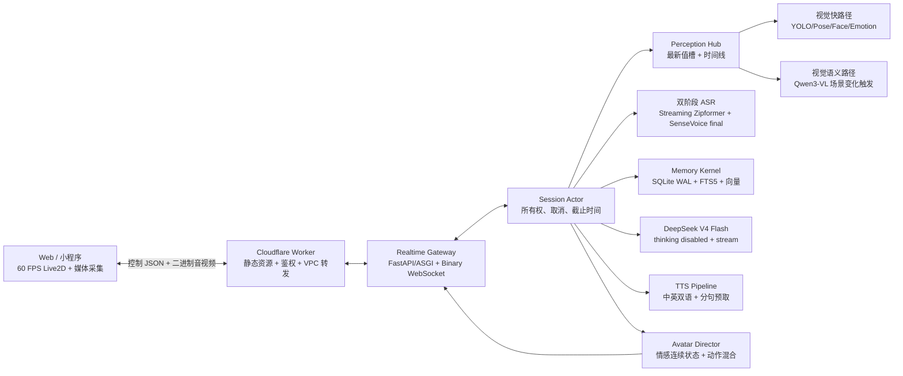

# VeyraSoul V2 生产架构

## 1. 为什么不是修补 V1

V1 已证明 RK3588 本地视觉、ASR、TTS、Cloudflare 公网入口和 Live2D 可以连通，但存在四个系统级瓶颈：

- Web 主控制文件约 3800 行，DOM、媒体采集、网络、Live2D、日志和设备设置共享状态，任何优化都容易产生交叉回归。
- 控制网关约 1200 行并基于同步 `ThreadingHTTPServer`；请求能并行进入，却没有“同一会话只有一个有效回答”的任务所有权和取消语义。
- 记忆只保存最近对话和少量正则偏好，没有情节记忆、冲突消解、语义检索、来源与置信度。
- 视觉“检测快路径”和 VLM“语义慢路径”虽已分开，但对话没有统一的时间一致快照，容易引用过期或不相关语义。

因此 V2 采用独立目录和新协议，只迁移经过验证的模型资源与板端推理适配器。

## 2. 总体结构

## 3. 会话编排

每个登录设备映射到一个 `SessionActor`。Actor 只消费有界控制队列；高频视觉帧进入 latest-value slot，不进入普通 FIFO。

一次语音交互：

1. 浏览器 AudioWorklet 发送 20 ms PCM16 二进制帧，同时本地只做能量/回声保护。
2. Streaming Zipformer 连续返回 partial；板端 endpoint 确认话音结束后，SenseVoice 对最终句段做一次校正。
3. Actor 立即取得 `VisualSnapshot`、`AffectState` 和 RAG 结果的时间一致快照。
4. DeepSeek V4 Flash 使用稳定 system/profile 前缀，显式 `thinking: disabled`、`stream: true`；稳定前缀有利于官方自动上下文缓存命中。
5. 流式文本按自然短句送入 TTS。首个音频块准备好后，前端才同步显示对应文字并播放；后续句子边播边合成。
6. Avatar Director 与首句 TTS 并行生成表情、视线和动作曲线；音频能量/音素驱动口型。
7. 用户再次开口时，Actor 增加 generation，取消旧 LLM/TTS/动作事件，保留已经确认的用户句段。

DeepSeek 官方说明 thinking 当前默认启用，因此 V2 必须显式关闭：
https://api-docs.deepseek.com/guides/thinking_mode/

官方上下文缓存采用完全相同前缀匹配，因此稳定角色设定放前、动态感知和检索结果放后：
https://api-docs.deepseek.com/guides/kv_cache/

## 4. 感知架构

### 4.1 快路径

目标 2–5 Hz，始终只处理最新帧：

- YOLO RKNN：人物和关键物体；
- YOLO Pose RKNN：骨架和短窗口动作；
- YuNet/SFace：人脸、身份；
- FER+：面部表情，但只作为情绪证据之一；
- Light-ASD：只在多人+有效语音时启用。

快路径输出结构化事实和置信度，不直接生成陪伴话术。

### 4.2 语义路径

Qwen3-VL 不固定盲跑：在以下事件触发，且最短间隔默认为 5 秒：

- 场景签名显著变化；
- 新人物进入；
- 用户明确询问视觉细节；
- 快路径发现未知高显著物体；
- 缓存语义超过最大年龄。

新触发覆盖等待中的旧触发，不积压。语义结果保存 `frame_id / observed_at / completed_at`，对话只能引用满足年龄和帧关联条件的结果。

## 5. 记忆与 RAG

### 5.1 五层记忆

| 层 | 内容 | 生命周期 |
| --- | --- | --- |
| 感知工作集 | 最新人物、环境、声音、角色状态 | 秒至分钟 |
| 会话工作记忆 | 当前主题、未完成指代、最近轮次 | 当前会话 |
| 情节记忆 | “何时、与谁、发生什么、情绪如何” | 长期、可衰减 |
| 语义/人物档案 | 名称、偏好、关系、稳定事实 | 长期、带置信度与修订历史 |
| 文档知识 RAG | 项目知识、角色设定、用户导入资料 | 版本化长期存储 |

### 5.2 存储与检索

- SQLite WAL 是唯一事实源，避免在单板上引入独立向量数据库进程。
- FTS5 负责中文/英文词法候选；本地 ONNX embedding 负责语义候选。
- 个人规模小于约 5 万条时，FTS 预筛 + 精确余弦足够，避免 ARM64 原生扩展部署风险。
- 词法、向量、重要度、时间衰减使用 RRF 融合；每条结果保留来源、时间、置信度。
- 同一 `subject + predicate` 出现不同值时创建新 revision 并停用旧事实，不覆盖历史。
- LLM 不能直接写长期记忆；Memory Curator 先提取候选，再根据稳定性、显式程度和冲突规则提交。

## 6. ASR 与 TTS 选型

### ASR

- 第一阶段：`sherpa-onnx streaming Zipformer zh-en int8`，提供实时 partial 和端点检测。
- 第二阶段：现有 SenseVoice 仅对最终片段校正，提高口音、混合语言和标点准确度。
- 用户感知不等待第二阶段才能看到监听反馈，但只有 final 文本进入 LLM。

sherpa-onnx 官方支持在线 Zipformer/Paraformer、partial result 和 WebSocket：
https://k2-fsa.github.io/sherpa/onnx/websocket/index.html

### TTS

部署时在 ELF2 实测后固定默认引擎，不进行请求级偷偷降级：

1. 首选候选：`kokoro-multi-lang-v1_1`，中英双语、声音选择多，重点测自然度和首包时延；
2. 低内存候选：`vits-melo-tts-zh_en`，163 MB、单声音、中英混合；
3. Matcha/Vocos 保留为性能对照；
4. VoxCPM 仅在用户主动选择后按需加载，绝不自动切换。

官方中英模型清单：
https://k2-fsa.github.io/sherpa/onnx/tts/all/

## 7. Live2D“生命感”系统

Live2D 不再接受离散的“happy + heart + motion”硬切换，而是接收连续 `AvatarIntent`：

- 基础生命层：呼吸、眨眼、微眼跳、重心漂移、头发惯性；
- 注意层：看向说话人、用户指针/触点、显著物体；
- 情感层：VAD 情感状态平滑映射到眉、眼、嘴形、身体张力；
- 话语层：音频 RMS + 可用音素/viseme 驱动口型；
- 手势层：句义动作在语音重音时间点触发；
- 打断层：用户开口时立即停止说话动作并转入倾听姿态。

参数每帧按优先级混合，动作只拥有声明过的参数组，避免不同 motion 相互覆盖。Live2D 官方建议从 model setting 读取 lip-sync/eye-blink 参数并注册为 motion effect，而不是硬编码一个嘴参数：
https://docs.live2d.com/en/cubism-sdk-manual/lipsync/

## 8. 前端信息架构

PC 是宣传主视图，移动端仍完整可用：

- 舞台占主视觉，角色保持第一优先；
- 顶部只显示连接、感知和隐私状态；
- 对话气泡靠近角色但不遮脸；
- 输入区固定在安全区内，录音是按住/点按可切换；
- 摄像头是可折叠画中画，默认不遮角色；
- 设置、模型、日志进入右侧 drawer（移动端 bottom sheet）；
- 调试 JSON 永不出现在普通用户界面。

React/Preact 只管理低频 DOM 状态；Live2D、音频、摄像头和 WebSocket 分别是独立生命周期模块，60 FPS 状态不进入组件重渲染。

## 9. 资源边界

RK3588 8 GiB 是共享内存，目标常驻预算：

| 进程 | 目标常驻/上限 |
| --- | ---: |
| Gateway + Session + Memory | 300 / 600 MiB |
| 快视觉与人脸 | 900 / 1600 MiB |
| Qwen3-VL | 2800 / 4200 MiB |
| Streaming ASR + final ASR | 500 / 900 MiB |
| 默认 TTS | 500 / 900 MiB |
| 系统与缓存安全余量 | 至少 1000 MiB |

模型并存必须用板端峰值验证；超预算时改变驻留策略或模型，不以 swap 掩盖问题。
