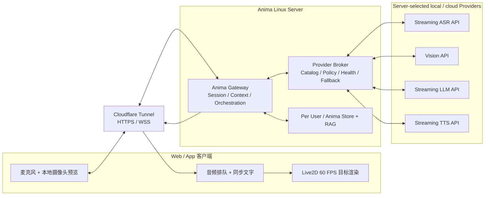

# Anima v0.0.1 系统架构

> 本文以 `new_code/` 当前实现为准。产品入口是 `https://anima.veyralux.org`，生产目标为可替换的 Linux Server。ELF2 只保留历史验证和可复现部署资料，不再是主运行平台。

## 1. 产品边界

Anima 是一个“浏览器/App 作为交互终端，Linux 主机作为会话与推理节点”的多模态产品，而不是将 UI 绑定在特定开发板上。

- **客户端**：直接呈现 Live2D、本地摄像头预览、麦克风采集、音频播放和触控。
- **Gateway**：拥有会话代际、打断、上下文组装、供应商调度和用户数据边界。
- **模态运行时**：ASR、视觉、LLM、TTS 通过稳定 Port 接入。生产优先选择支持取消、流式返回和明确数据策略的 API Provider；本地模型保留为可选 Adapter，而非默认前提。
- **部署主机**：普通 x86_64/aarch64 Linux Server 承担认证、编排、记忆、RAG、Provider Broker 和同源 Web；不要求服务器具有本地 GPU。

## 2. 运行拓扑


```mermaid
flowchart LR
  subgraph Client["Web / App 客户端"]
    Media["麦克风 + 本地摄像头预览"]
    Live2D["Live2D 60 FPS 目标渲染"]
    Playback["音频排队 + 同步文字"]
  end

  Edge["Cloudflare Tunnel\nHTTPS / WSS"]

  subgraph Host["Anima Linux Server"]
    Gateway["Anima Gateway\nSession / Context / Orchestration"]
    Broker["Provider Broker\nCatalog / Policy / Health / Fallback"]
    Memory["Per User / Anima Store + RAG"]
  end

  subgraph Providers["Server-selected local / cloud Providers"]
    ASR["Streaming ASR API"]
    Vision["Vision API"]
    LLM["Streaming LLM API"]
    TTS["Streaming TTS API"]
  end

  Media <--> Edge <--> Gateway
  Gateway <--> Memory
  Gateway <--> Broker
  Broker <--> ASR
  Broker <--> Vision
  Broker <--> LLM
  Broker <--> TTS
  Gateway --> Edge --> Playback --> Live2D
```

公网只暴露反向代理或 Cloudflare 管理的 HTTPS/WSS 入口。Gateway 默认仅监听 loopback；候选发布实例使用独立 loopback 端口。Provider 密钥、真实上游地址和本地 sidecar 端口不向客户端或公网暴露。

## 3. 稳定契约与供应商解耦

编排层只依赖能力，不依赖具体模型名或 SDK：

| 模态 | 稳定能力 | 当前仓库实现 | 尚未实现的替换方向（目标） |
| --- | --- | --- | --- |
| ASR | `StreamingAsrProvider` | sherpa-onnx streaming；可显式禁用 | **优先补齐云实时 ASR API**，本地 sherpa 作为隐私/降本选项 |
| Vision | `VisionProvider` | 可选的同机 `local-vlm` HTTP；可显式禁用 | **优先补齐云视觉 API**，再接结构化快路或本地 VLM |
| LLM | `ChatProvider` | DeepSeek 非思考 SSE | 增加 OpenAI-compatible 与其他流式 LLM Adapter |
| TTS | `StreamingTtsProvider` | sherpa-onnx 本地 TTS | **优先补齐流式云 TTS API**，本地音色作为可选方案 |

组合根根据服务级 Provider Catalog 和 Anima 的已授权别名选择 Adapter。Catalog 借鉴 AIRI 的“用户只看到能力别名、运维配置拥有真实路由”边界：供应商 URL、密钥、并发池和回退链只存在服务器侧；客户端只能选择被公开且已启用的别名。一轮对话冻结不可变 Provider snapshot，中途不切换；失败只按服务器策略进入下一上游，不能由用户 payload 注入地址或密钥。

Python 包/导入路径 `veyrasoul` 与 `VEYRASOUL_*` 环境变量仅作为已存在的内部兼容名；新部署使用 `ANIMA_*`。这些标识符不是对外产品名，也不代表另一个产品版本。

## 4. 会话所有权与可取消代际

逻辑上必须分开：

`TenantId -> UserId -> AnimaId -> ConversationId -> SessionId -> TurnId -> Generation`

- `ConversationActor` 是对话的单写者，不把 WebSocket 连接当作所有权。
- 新发言、挂断或断线递增 `Generation`；旧代 ASR/LLM/TTS/Avatar 事件在写入前再验证。
- 取消是端到端语义：停止供应商流、丢弃未播音频、静音当前播放并阻止旧代记忆写入。
- 多标签页/重连不得为同一 Conversation 创建两个同时写入的 actor。

## 5. 实时媒体与背压

当前 wire path 是 `/v2/realtime`。其中 `v2` 是**网络协议版本**，不是产品代号；Anima 产品版本为 `v0.0.1`。

一条连接内使用明确优先级：

1. cancel / session / settings 控制事件；
2. 语音 PCM，只容许约 120–200 ms 有界积压；
3. 视觉 JPEG，latest-only，拥塞时直接丢弃旧帧。

控制事件不能被图像或回复音频头阻塞。客户端观测 `WebSocket.bufferedAmount`；服务端为各媒体类型使用有界队列。发生拥塞时优先保留打断和最新语义，不保证每帧到达。

## 6. 视觉分层

| 路径 | 频率 | 责任 |
| --- | ---: | --- |
| 本地 `<video>` 预览 | 目标 60 FPS | 直接渲染 MediaStream，不等待编码/上传/推理 |
| 关键帧上传 | 默认 2 Hz | 缩放 JPEG，latest-only，为快路和语义路提供输入 |
| 场景语义 | 默认每 5 s | 人物、外观/表情、动作、环境和物体的结构化快照 |

每个 `VisualSnapshot` 使用服务端观测时间、`frame_id`、完成时间、信心度与来源。一轮上下文只冻结一份视觉快照；无论用户是否直接询问画面，只要快照仍新鲜，就以紧凑语义加入上下文。模型回复不应照读“画面中有 1 人”等检测器原始字段，而应使用自然、可校验的描述。

## 7. 对话、记忆与同步呈现

`ContextPlanner` 按总 token 预算组装稳定前缀、近期对话、少量有来源的长期记忆、当前视觉快照和用户本轮输入。稳定内容在前，动态内容在尾部，以利用供应商 prompt cache。

回复链路不允许为了“看起来快”而先显示全文或使用固定死答案。文本在对应音频真正开始播放时呈现；优化手段是流式 LLM、短句切分、流式 TTS、音频预取与 AudioWorklet 排队，不是假进度。

长期数据按 `UserId/AnimaId` 物理分库。检索候选、`Anima.md`、文档 RAG、声纹/人脸特征和供应商请求都必须经过同一 owner scope。原始音视频默认不进入长期记忆。

## 8. Live2D 与角色生命感

Live2D 模型在客户端由 Cubism/Pixi 真实加载，不是服务端视频流。浏览器负责：

- 桌面/移动端纹理档位和 ResizeObserver 适配；
- breathing/blink/gaze/affect 连续信号混合；
- 按实际播放时间的 RMS 口型；
- expression/motion 能力表、优先级、冷却和代际门控；
- 点击、长按、轻抚等本地身体交互，不上传原始指针轨迹。

Live2D SDK 许可和具体模型的 Web 托管/再分发授权是两件事。公网发布制品必须有可审计的模型授权证据或使用可公开分发的替代资产。

## 9. 可观测性与 SLO

每轮使用 `TurnTrace`：ASR final、context ready、LLM request/first delta/completed、first clause、TTS submit/first audio、reply frame、playback ack、complete/cancel/error。进程内耗时使用 monotonic clock，跨端事件附带 wall clock 和时钟偏差样本。

日志不记录 API key、Authorization、prompt/回复正文、原始音视频、`Anima.md` 或用户绝对路径。详细口径见 [latency-slo.md](./latency-slo.md)。

## 10. 服务器部署

Linux Server 使用与硬件无关的目录合同：

```text
/opt/anima/releases/<release-id>  # 只读源码、web/dist 与部署工具
/opt/anima/current                # 原子指向活跃 release
/opt/anima/candidate              # 仅 loopback 候选实例
/opt/anima/models                 # 可选本地模型，不进入 release
/etc/anima/anima.env              # 非敏感运行参数，root:anima 0640
/etc/anima/credentials/           # Provider 密钥或 systemd credentials，禁止进仓库
/var/lib/anima                    # 用户数据、目录库、RAG 与发布状态
```

发布严格按 `stage -> candidate health -> atomic activate -> health -> ingress`。候选实例失败不改变当前服务；激活失败恢复上一 release。服务使用专用低权限账号，Provider 出站仅允许 Catalog 中的 HTTPS 主机；密钥通过 systemd credential、主机 Secret Store 或 root-only 文件注入，不进入环境模板、日志、数据库或浏览器。多实例上线前必须把认证、租约、限流和任务协调从单机 SQLite/内存实现迁到具有明确一致性语义的共享基础设施。
