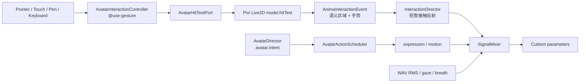

# Live2D 身体交互与自主表现

> 本文描述 VeyraSoul V2 当前的浏览器端身体交互契约、实现边界和验收方法。它不把模型动作按钮重新包装成另一套控制盘，也不把尚未取得的模型再分发权视为已解决。

## 1. 产品原则

V2 的角色首先是一个持续存在、能自主表达的 Anima，而不是等待用户点击动作列表的播放器：

- 页面不提供动作盘、动作轮盘或表情快捷键；
- 用户通过鼠标、触摸、手写笔或键盘直接接触角色，而不是选择模型资产名；
- 服务端 `AvatarDirector` 只输出与渲染器无关的阶段、情感和动作意图；
- 浏览器根据本地能力表选择可用的 Live2D expression/motion，并把瞬时接触反射叠加到连续参数上；
- 交互失败不得阻塞语音、文字、摄像头或 WebSocket 主链路。

“无动作盘”不等于角色没有动作。待机、倾听、思考、说话、情感衰减和离散动作仍由自主导演产生；身体接触只提供短暂、可衰减的局部刺激，不永久夺取角色状态。

## 2. 成熟手势方案

浏览器使用固定版本 `@use-gesture/vanilla@10.3.1`，而不是自行维护一套互不兼容的 mouse/touch 事件状态机。当前安装同时包含其运行时依赖 `@use-gesture/core@10.3.1`，两者均为 MIT License，声明见 [`../web/public/THIRD_PARTY_NOTICES.md`](../web/public/THIRD_PARTY_NOTICES.md)；该文件会随 Vite `public` 目录进入构建制品。

选择它的原因：

- 统一 Pointer Events、鼠标 hover、拖动和触摸接触；
- 提供 pointer capture、tap 过滤、取消和销毁生命周期；
- 允许把视觉命中、手势识别和角色反射拆成独立层；
- 不要求 React，也不会把高频指针数据写入 Preact 状态树。

当前识别参数是显式产品参数，而不是浏览器默认值：

| 行为 | 当前规则 |
| --- | --- |
| 首次接触 | 主指针且鼠标仅接受左键；必须命中角色区域 |
| tap | 位移未超过 7 px，且未形成长按或抚摸 |
| press | 持续至少 380 ms 且此前未形成抚摸 |
| stroke | 累计位移至少 7 px；最多每 48 ms 生成一次语义事件 |
| hover | 仅鼠标；进入和离开命中区域各发一个本地语义事件 |
| cancel | pointer cancel、lost capture 或舞台销毁立即清理本次接触 |
| keyboard | 聚焦角色舞台后，Enter/Space 生成一次 `face + tap` 等价主交互 |

这些阈值后续可以通过真机可用性测试调整，但不得散落到 CSS、组件和模型适配器中形成多份定义。

## 3. 分层架构



各层职责如下：

1. `AvatarInteractionController` 识别接触手势，维护唯一活动指针、长按计时器和节流；
2. `Live2DHitTestPort` 把浏览器 client 坐标转换成 Pixi renderer 坐标，并调用模型公开 `hitTest`；
3. 模型适配表只负责把 Strawberry Rabbit 的 HitArea 名称映射成稳定身体语义；
4. `InteractionDirector` 根据手势强度、当前 speaking/listening 阶段以及 affinity/trust 生成短时参数偏移；
5. `SignalMixer` 在同一 60 FPS 更新点合并自主意图、真实音频口型、注视和接触反射；
6. `AvatarActionScheduler` 仍负责离散 expression/motion 的能力过滤、抢占、冷却和 generation 门控。

接触反射与对话导演互不伪装：低 affinity/trust 时，脸和耳朵等敏感区域可以表现为轻微回避；关系足够亲近时才表现为靠近或放松。speaking/listening 期间反射幅度会衰减，避免抚摸让口型、倾听姿态或打断语义失真。

## 4. 语义契约

### 4.1 身体区域

稳定的 `AnimaBodyArea` 当前包含：

```text
face
ear.left / ear.right
hand.left / hand.right
arm.left / arm.right
torso
skirt
leg.left / leg.right
```

所有 `.left/.right` 都表示**舞台画面中的视觉左/右**，不是角色自身的解剖学左/右。这样点击屏幕左侧得到 `.left`，不会因角色朝向或美术命名习惯改变。若未来自然语言需要表达“她的左手”，必须在上层显式转换，不能复用视觉后缀并假装两种坐标系相同。

当前 Strawberry Rabbit 对应关系：

| HitArea | Drawable | 语义区域 | 运行时核验 |
| --- | --- | --- | --- |
| `Face` | `ArtMesh564` | `face` | 默认可见，边界覆盖整脸 |
| `EarVisualLeft` | `ArtMesh264` | `ear.left` | 屏幕左耳 |
| `EarVisualRight` | `ArtMesh268` | `ear.right` | 屏幕右耳 |
| `HandVisualLeft` | `ArtMesh541` | `hand.left` | 屏幕左侧宽袖末端/手部 |
| `HandVisualRight` | `ArtMesh439` | `hand.right` | 屏幕右侧宽袖末端/手部 |
| `ArmVisualLeft` | `ArtMesh427` | `arm.left` | 屏幕左侧手臂与宽袖 |
| `ArmVisualRight` | `ArtMesh432` | `arm.right` | 屏幕右侧手臂与宽袖 |
| `Torso` | `ArtMesh361` | `torso` | 上衣/上胸 |
| `Skirt` | `ArtMesh349` | `skirt` | 裙摆 |
| `LegVisualLeft` | `ArtMesh515` | `leg.left` | 屏幕左腿 |
| `LegVisualRight` | `ArtMesh543` | `leg.right` | 屏幕右腿 |

桌面 4096 纹理和移动 1024 纹理配置引用同一个 `.moc3`，因此使用同一组 drawable ID 和几何。模型命中可能同时返回多个重叠区域，语义层按以下优先级只选一个：

```text
hand > arm > ear > face > torso > skirt > leg
```

未知 HitArea 必须忽略，不能回退成任意动作。

### 4.2 接触事件

`AnimaInteractionEvent` 是渲染器无关的本地语义事件：

| 字段 | 含义 |
| --- | --- |
| `sequence` | 本地单调递增序号 |
| `area` | 上述稳定身体语义 |
| `gesture` | `hover-enter`、`hover-leave`、`contact`、`tap`、`press`、`stroke` 或 `release` |
| `pointerType` | `mouse`、`touch`、`pen` 或 `keyboard` |
| `durationMs` | 本次接触持续时间 |
| `intensity` | 归一化到 `[0, 1]` 的局部强度 |
| `direction` | 抚摸方向的可选单位向量 |
| `occurredAtMs` | 浏览器单调时钟时间 |

当前事件只在浏览器中驱动即时视觉反馈和 `InteractionDirector`，不进入聊天文本、长期记忆、分析日志或网络协议。若以后确需让服务端理解“用户摸了耳朵”，只能上传去坐标化、限频、版本化且经用户同意的语义事件；不得上传原始指针轨迹。

## 5. 自主导演与参数所有权

身体交互不能重新制造动作按钮式的硬编码答案。表现层按以下所有权顺序工作：

1. 服务端 `AvatarDirector` 根据会话阶段、连续情感和 generation 产生 `avatar.intent`；
2. `AvatarActionScheduler` 在模型能力白名单内选择实际 expression/motion；
3. `InteractionDirector` 只产生有截止时间的 `head/body/smile/eye` 偏移；
4. `SignalMixer` 在 `beforeModelUpdate` 合并呼吸、眨眼、注视、RMS 口型与上述偏移；
5. 真实 WAV RMS 对嘴形拥有最终所有权，接触不能覆盖正在播放的语音口型；
6. 新 generation、舞台销毁或 release 会缩短/清除旧反射，禁止旧交互在重连后复活。

手势与区域用于调节反射，不直接映射成一句固定台词。当前浏览器也不会因为每次抚摸都发起 LLM 请求；这同时避免死答案、网络等待和无意义 token 消耗。

## 6. 性能边界

- `<canvas>` 与 Pixi/Cubism 保持自己的 60 FPS ticker；手势处理不触发 Preact 每帧重渲染；
- pointer move 只更新本地 gaze；stroke 语义事件有 48 ms 节流；
- 命中测试使用当前帧 drawable vertices，模型缩放、移动和动作后无需维护屏幕百分比矩形；
- 优先使用 Pixi interaction manager 的 `mapPositionToPoint` 处理 DPR、canvas 缩放和 viewport；只有运行库不提供 mapper 时才使用 canvas/renderer 比例回退；
- 视觉反馈使用短生命周期 DOM dataset/CSS 状态，不创建持续增长的粒子或计时器集合；
- 本链路禁止网络、磁盘和模型推理调用，也不得与摄像头 JPEG 编码共享队列。

目标验收不是“看起来能点”：桌面、移动竖屏和移动横屏都应测量命中正确率、误触、Long Task、Live2D 帧耗 P95 和销毁后的监听器/计时器残留。真实手机结论不能由桌面 Chromium 模拟替代。

## 7. 隐私与无障碍

- 原始 `clientX/clientY`、完整路径、压力轨迹和设备标识保持在浏览器渲染层；
- 交互数据不进入 Memory/RAG，不用于画像，也不与摄像头画面绑定；
- 调试 dataset 只包含区域、手势和局部序号，舞台销毁时删除；
- 角色舞台可聚焦，并提供 Enter/Space 等价主交互，不能要求所有用户完成拖拽；
- `prefers-reduced-motion` 下应继续保留语义和焦点反馈，但降低接触脉冲与大幅反射；
- 视觉反馈不能成为理解交互结果的唯一途径，屏幕阅读器标签应说明角色可互动。

## 8. 资源生命周期

每次舞台启动只允许一个 gesture controller、一个活动接触和一个 press timer。销毁顺序必须满足：

1. 调用 gesture handle 的 `destroy()`，解除 `@use-gesture` 注册的监听；
2. 清除长按与视觉反馈 timer；
3. 取消活动接触、hover 和 gaze；
4. 重置 `InteractionDirector`，移除调试 dataset；
5. 解除 Live2D `beforeModelUpdate`，销毁 action scheduler；
6. 销毁 Pixi application、纹理和 model 引用。

重复 `start()`、模型加载期间关闭、权限失败和组件卸载都必须走同一清理路径。不能依赖页面刷新回收 WebGL、pointer capture 或计时器。

## 9. 已知技术债

### 9.1 AABB 命中不是精确轮廓

`pixi-live2d-display@0.4.0` 对 model3 `HitAreas` 使用当前 drawable 顶点的轴对齐包围盒（AABB），不是三角网格或 alpha 命中。因此：

- 透明角落可能被算作命中；
- 脸与耳根、手与宽袖等区域可能重叠；
- 当前优先级只能稳定仲裁重叠，不能恢复真实像素轮廓。

现有 drawable 已通过运行时边界叠图、默认可见度、父部件和桌面/移动配置同步核验，适合作为当前可验证实现。最终方案应由模型作者在 `.cmo3` 中增加低多边形、透明、随变形的专用碰撞 ArtMesh，再重新导出 `.moc3`；不得长期堆叠手写 DOM 矩形修补模型。

### 9.2 模型资源授权待闭环

Cubism Core、Pixi 和 `pixi-live2d-display` 的软件许可证不自动授予 Strawberry Rabbit 模型、美术、纹理或动作的公开再分发权。当前模型 manifest 明确记录：

```text
licenseStatus = verification-required-before-public-redistribution
```

在公开发布、代码开源包或 CDN 分发模型前，必须保存能够覆盖目标使用方式的购买凭证、作者许可或资源包许可证，并明确是否允许：公开 Web 托管、比赛展示、修改纹理、再分发 `.moc3` 和商业使用。无法证明授权时，应把模型从公开制品中排除，改由部署者私下放置已授权资产；不能用删除来源路径或写一份第三方声明替代授权。

## 10. 验收清单

1. 桌面和移动 model3 的 HitArea 名称、ID、manifest map 与运行时代码完全同步；
2. 每个 drawable ID 存在、默认可见且边界宽高大于零；
3. DPR 1/1.5/2、canvas 缩放、横竖屏后点击仍命中同一视觉区域；
4. 手优先于袖子、耳朵优先于脸，未知 mesh 不触发动作；
5. tap、380 ms press、stroke、cancel、release 和键盘路径均有测试；
6. speaking/listening 时接触不会破坏 RMS 口型或代际门控；
7. 反复进入/离开舞台后无重复回调、悬挂 timer 或 WebGL 资源增长；
8. 原始坐标和轨迹不出浏览器、不进入记忆；
9. 页面没有动作盘，角色在无用户点击时仍会自主待机、倾听、思考和表达；
10. Strawberry Rabbit 公网再分发授权在发布前已有可审计证据。
