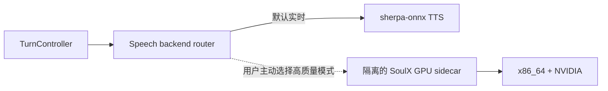
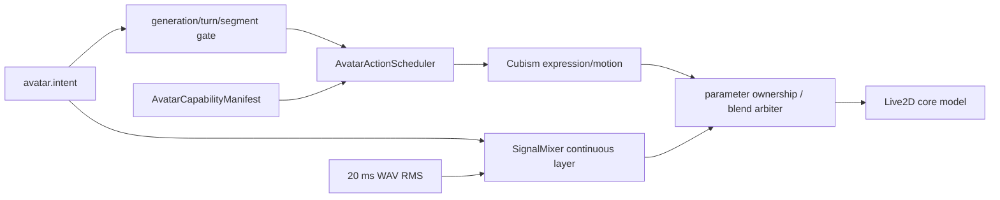

# 外部参考方案事实核查与架构决策

> 核查日期：2026-07-13
>
> 范围：`Soul-AILab/SoulX-Podcast`、`kimjammer/Neuro` 及 Neuro 明确链接的控制台仓库。
> 状态约定：本文区分“上游事实”“本项目现状”“候选试验”和“已验收结果”。候选试验不得写入已实现能力清单。

## 1. 决策摘要

| 参考方案 | 可借鉴价值 | 不采用部分 | 当前决策 |
|---|---|---|---|
| SoulX-Podcast | 中英 TTS、zero-shot 声音克隆、长文本/多说话人、副语言标签 | 当前无流式推理；CUDA/vLLM 依赖；没有 RK3588/RKNN 路径 | **否决进入默认实时主链路**；仅允许在独立 x86_64 NVIDIA 主机上做隔离的高质量 GPU sidecar 试验 |
| Neuro | VTube Studio 动作队列、能力枚举、人工动作控制台的交互模式 | VTube Studio、Steam、虚拟音频线、Windows/NVIDIA 桌面运行时、全局共享 Signals | **不引入其运行时或代码架构**；离散动作思想已 clean-room 落为浏览器 `AvatarActionScheduler` 最小纵切片，仍需真机性能与全资产验收 |

这两个结论不改变 V2 的当前边界：V1 继续在 ELF2 和评审站点运行；V2 仍处于开发阶段，不部署到开发板，不替换评审入口。

## 2. 证据等级

本文使用以下证据等级，避免把宣传语当成已验证事实：

1. **代码事实**：固定 commit 中可定位的实现、依赖和调用路径；
2. **作者事实**：固定 README、License、Release 或作者/协作者 Issue 回复；
3. **模型仓库事实**：Hugging Face 模型卡、文件清单和参数统计；
4. **外部实测**：Issue 用户提供的环境和日志，只作风险参考，不等价于本项目实测；
5. **本项目推断**：由上述事实推导出的架构结论，必须明确标为推断或预算估算。

---

## 3. SoulX-Podcast

### 3.1 固定版本与许可证

- GitHub 仓库：<https://github.com/Soul-AILab/SoulX-Podcast>
- 本次核查 commit：[`5ac9c0e1cfe596396200c7d38e3fd53b7b3fbf4b`](https://github.com/Soul-AILab/SoulX-Podcast/tree/5ac9c0e1cfe596396200c7d38e3fd53b7b3fbf4b)
- commit 时间：2025-12-11；该仓库本次核查时没有 GitHub Release 或 Tag；
- 代码许可证：[Apache License 2.0](https://github.com/Soul-AILab/SoulX-Podcast/blob/5ac9c0e1cfe596396200c7d38e3fd53b7b3fbf4b/LICENSE)；
- Base 与 Dialect 模型卡均标记 Apache-2.0：
  - <https://huggingface.co/Soul-AILab/SoulX-Podcast-1.7B>
  - <https://huggingface.co/Soul-AILab/SoulX-Podcast-1.7B-dialect>

许可证允许修改和再分发，但若后续复制代码或分发模型，仍需保留 Apache-2.0 要求的许可证与声明。本结论不自动覆盖参考音频、用户克隆音色或其他第三方资产的权利状态。

### 3.2 模型与推理架构事实

固定代码中的推理链路为：

1. 参考音频由 `s3tokenizer` 转为 25 Hz speech token；
2. Qwen3 架构的自回归 LLM 生成目标 speech token；
3. `CausalMaskedDiffWithXvec` Flow 生成 mel；
4. `HiFTGenerator`/HiFi-GAN 生成 24 kHz WAV。

证据：

- [`SoulXPodcast.__init__` 与 `forward_longform`](https://github.com/Soul-AILab/SoulX-Podcast/blob/5ac9c0e1cfe596396200c7d38e3fd53b7b3fbf4b/soulxpodcast/models/soulxpodcast.py#L22-L166)
- [HF/vLLM engine](https://github.com/Soul-AILab/SoulX-Podcast/blob/5ac9c0e1cfe596396200c7d38e3fd53b7b3fbf4b/soulxpodcast/engine/llm_engine.py)
- [模型配置](https://github.com/Soul-AILab/SoulX-Podcast/blob/5ac9c0e1cfe596396200c7d38e3fd53b7b3fbf4b/soulxpodcast/config.py)

虽然模型名包含 `1.7B`，Hugging Face API 对 Base 模型 safetensors 的统计是 **2,062,672,896 个 BF16 参数**。主要文件事实如下：

| 资产 | 文件大小 |
|---|---:|
| 三个 Qwen3 safetensors 分片合计 | 4,125,381,392 B |
| `flow.pt` | 450,575,567 B |
| `hift.pt` | 83,390,254 B |
| Base 模型仓库总存储（含重复 cache、ONNX 等资产） | 9,893,404,581 B |

“模型文件能放进 8 GB”不等于“8 GB 系统能完成推理”。运行时还需要 audio tokenizer、Flow、HiFT、KV cache、激活张量、PyTorch/Python 和操作系统内存。

### 3.3 能力事实及证据边界

上游 README 声明并提供代码入口的能力：

- 普通话和英语；
- 四川话、河南话、粤语；
- 跨方言 zero-shot voice cloning；
- 长文本、多轮、多说话人播客；
- `<|laughter|>`、`<|sigh|>`、`<|breathing|>`、`<|coughing|>`、`<|throat_clearing|>` 副语言标签。

证据：

- [README 能力说明](https://github.com/Soul-AILab/SoulX-Podcast/blob/5ac9c0e1cfe596396200c7d38e3fd53b7b3fbf4b/readme.md#L27-L40)
- [使用普通话参考音频生成英文的示例](https://github.com/Soul-AILab/SoulX-Podcast/blob/5ac9c0e1cfe596396200c7d38e3fd53b7b3fbf4b/example/podcast_script/script_english.json)

**尚未得到证据支持的能力：**

- 官方示例没有覆盖“同一句中频繁中英切换”的 code-switch 质量；
- 没有仓库级首次可播放音频、热启动 P50/P95、RTF、峰值显存或 RK3588 基准；
- 没有证明其 voice clone 在本项目角色音色、短句和副语言场景中的主观偏好；
- 没有证明取消请求后 GPU 任务和显存能及时释放。

因此，当前只能写“支持中文和英文，值得测试中英混合”，不能写“已验证高质量中英混合”。

### 3.4 流式和低时延事实

上游当前版本**不具备可直接接入视频通话的流式首音频路径**：

- README 的 `Add support for streaming inference` 仍是未完成 TODO：
  [README L183-L190](https://github.com/Soul-AILab/SoulX-Podcast/blob/5ac9c0e1cfe596396200c7d38e3fd53b7b3fbf4b/readme.md#L183-L190)
- Flow 调用明确为 `streaming=False, finalize=True`：
  [soulxpodcast.py L151-L159](https://github.com/Soul-AILab/SoulX-Podcast/blob/5ac9c0e1cfe596396200c7d38e3fd53b7b3fbf4b/soulxpodcast/models/soulxpodcast.py#L151-L159)
- `/generate` 在完整推理、拼接、写盘后才返回 `FileResponse`：
  [api/main.py L141-L216](https://github.com/Soul-AILab/SoulX-Podcast/blob/5ac9c0e1cfe596396200c7d38e3fd53b7b3fbf4b/api/main.py#L141-L216)
- 服务端超时设置为 `max(1200, num_segments * 120)`，接口设计更接近长任务生成：
  [api/service.py L209-L235](https://github.com/Soul-AILab/SoulX-Podcast/blob/5ac9c0e1cfe596396200c7d38e3fd53b7b3fbf4b/api/service.py#L209-L235)
- vLLM 只加速自回归 token 阶段，不能使当前整段 WAV API 自动变成流式。

**架构结论：否决 SoulX-Podcast 进入默认实时主链路。** 当前默认仍保留 sherpa-onnx Matcha/Kokoro/VITS 适配边界，并继续优化真正的首音频和取消路径。

### 3.5 RK3588 aarch64 / 8 GB 可行性

原仓库不能直接部署到 ELF2：

- audio tokenizer、Flow、HiFT 和多个输入均无条件调用 `.cuda()`：
  [soulxpodcast.py L25-L46](https://github.com/Soul-AILab/SoulX-Podcast/blob/5ac9c0e1cfe596396200c7d38e3fd53b7b3fbf4b/soulxpodcast/models/soulxpodcast.py#L25-L46)
- 依赖固定 `torch==2.7.1`、`torchaudio==2.7.1`、`triton>=3.0.0`，并包含 `onnxruntime-gpu`：
  [requirements.txt](https://github.com/Soul-AILab/SoulX-Podcast/blob/5ac9c0e1cfe596396200c7d38e3fd53b7b3fbf4b/requirements.txt)
- Docker 基于 NVIDIA vLLM，并替换定制 vLLM fork 文件：
  [runtime/vllm/Dockerfile](https://github.com/Soul-AILab/SoulX-Podcast/blob/5ac9c0e1cfe596396200c7d38e3fd53b7b3fbf4b/runtime/vllm/Dockerfile)
- 仓库没有 Qwen 主体的 RKNN 导出、Mali 后端或完整的 ARM/NPU 推理图；
- 官方协作者表示 CPU 理论可通过修改 `.cuda()` 使用，但速度非常慢、不推荐：
  [Issue #18](https://github.com/Soul-AILab/SoulX-Podcast/issues/18)、[Issue #37](https://github.com/Soul-AILab/SoulX-Podcast/issues/37)。

[Issue #26](https://github.com/Soul-AILab/SoulX-Podcast/issues/26) 的第三方日志记录了 vLLM 权重约 3.24 GiB、峰值激活约 1.49 GiB，以及默认 0.9 utilization 下的大量 KV cache 预留。该日志只能证明某个 NVIDIA 环境的行为，不能证明 RK3588 可运行。

**架构结论：**不在当前 V2 阶段把 SoulX 移植 RKNN/NPU；不允许它与 ELF2 上的 V1 或 V2 轻量模型争抢内存。真正完成量化、算子替换、ARM/NPU 导出和流式改造属于数周级高风险研发，而不是安装适配。

### 3.6 可选 GPU sidecar 试验

这是候选试验，**尚未实现、尚未跑分**：

试验必须满足以下隔离条件：

- 独立进程、独立虚拟环境或容器；
- 不把 SoulX 的 Torch/Transformers/Triton/vLLM 版本带入 V2 Gateway；
- 不部署到 ELF2；
- 只通过稳定的 `SpeechSynthesizer` adapter 或本地 IPC/HTTP 边界接入；
- 默认音色仍是轻量实时后端，SoulX 只能由用户主动选择；
- 参考音频和提取后的说话人特征按用户/Anima 隔离存储。

建议实验语料固定为 30 条：普通话 10、英语 6、中英混合 8、副语言标签 6。建议 PC 预算为约 15 GB 磁盘、24–32 GB RAM、至少 12 GB NVIDIA VRAM；这些是保守实验预算，不是上游官方最低要求。

### 3.7 SoulX 验收门槛

#### 默认实时主链路门槛

只有同时满足以下条件才允许重新讨论进入默认主链路：

1. 提供真正的音频分块，不等待完整 WAV；
2. ≤20 个汉字或 ≤12 个英文词短句，热启动 P95 首次可播放音频 ≤1,000 ms；
3. 用户打断后 ≤150 ms 停止下发旧音频，且旧 generation 不再播放；
4. 连续 100 次生成/取消无任务泄漏，GPU reserved memory 相对稳定基线增长不超过 5%；
5. 30 条中英/副语言固定集全部生成成功，无空音频、NaN 或协议错误；
6. 不降低 V2 ASR、VLM、Gateway 的时延和稳定性。

上游当前整段 WAV 实现尚不满足第 1 条，所以当前否决结论是确定的，而不是等待主观试听。

#### 可选高质量 sidecar 门槛

1. 30/30 固定语料成功；
2. 热启动短句 P95 首次可播放音频 ≤3,000 ms，整段 RTF ≤0.8；
3. 中英混合盲测中，相对当前默认音色的自然度偏好率达到 70%，且中文可懂度不下降；
4. 峰值显存不超过实验主机预算；
5. sidecar 故障或超时不影响默认 TTS，能在一个 turn 内回退；
6. 用户未主动选择时不得调用。

---

## 4. Neuro

### 4.1 固定版本与许可证

- GitHub 仓库：<https://github.com/kimjammer/Neuro>
- 本次核查 commit：[`5e4b4241c41bb40983aee2cb60d65d6bb481842b`](https://github.com/kimjammer/Neuro/tree/5e4b4241c41bb40983aee2cb60d65d6bb481842b)
- commit 时间：2025-01-16；
- 最新 Release：[`v0.2.2`](https://github.com/kimjammer/Neuro/releases/tag/v0.2.2)，发布时间 2024-11-13；
- 许可证：[MIT](https://github.com/kimjammer/Neuro/blob/5e4b4241c41bb40983aee2cb60d65d6bb481842b/LICENSE)。

### 4.2 实际协议与运行时

Neuro 不是浏览器内 Live2D renderer。其角色层是 Windows 桌面编排：

- `pyvts` 连接并认证 VTube Studio Plugin API；
- token 保存在本地 `vtubeStudio_token.txt`；
- 使用 `requestHotKeyList`、`requestTriggerHotKey`、`ItemListRequest`、`ItemLoadRequest`、`ItemMoveRequest`、`ItemUnloadRequest` 和 `MoveModelRequest`；
- 后端 Socket.IO 暴露 `get_hotkeys`、`send_hotkey`、`trigger_prop`、`move_model`；
- 独立 Svelte 控制台由操作者人工点击动作。

证据：

- [VTube Studio module](https://github.com/kimjammer/Neuro/blob/5e4b4241c41bb40983aee2cb60d65d6bb481842b/modules/vtubeStudio.py)
- [Socket.IO server](https://github.com/kimjammer/Neuro/blob/5e4b4241c41bb40983aee2cb60d65d6bb481842b/socketioServer.py)
- [neurofrontend 人工 VTube 控制页](https://github.com/kimjammer/neurofrontend/blob/365dd6d7f9febc87daccd7491054be8954a85c35/src/routes/vtube/%2Bpage.svelte)

作者完整环境是 Windows 11、Python 3.11.9、RTX 4070 12 GB、CUDA 11.8，并依赖 VTube Studio/Steam、虚拟音频线，OBS 为展示层：
[README L92-L105](https://github.com/kimjammer/Neuro/blob/5e4b4241c41bb40983aee2cb60d65d6bb481842b/README.md#L92-L105)。

这套运行时无法满足 V2 的任意浏览器、移动端/平板端和 ELF2 服务端边界。

### 4.3 表情、动作与口型事实

Neuro 没有自动的“情绪 → 表情/动作”映射：

- README 明确称 Vtuber model control `currently basic`；
- hotkey、道具和模型位置动作由控制台人工触发；
- `Signals` 只有 human speaking、AI thinking、AI speaking 等布尔状态；
- VTube module 没有读取 LLM 情绪、连续 affect 或回复语义；
- 仓库没有 emotion/expression/viseme 映射器。

证据：

- [README L55-L61](https://github.com/kimjammer/Neuro/blob/5e4b4241c41bb40983aee2cb60d65d6bb481842b/README.md#L55-L61)
- [signals.py](https://github.com/kimjammer/Neuro/blob/5e4b4241c41bb40983aee2cb60d65d6bb481842b/signals.py)
- [动作队列](https://github.com/kimjammer/Neuro/blob/5e4b4241c41bb40983aee2cb60d65d6bb481842b/modules/vtubeStudio.py#L140-L188)

口型由 TTS 音频经虚拟音频线输入 VTube Studio，再由 VTube Studio 把 microphone volume 绑定到 mouth open；仓库自身没有 RMS envelope、phoneme 或 viseme 时序。

此外，Neuro 虽以 SSE 获取 LLM token，但代码在完整 SSE 结束后才调用 `tts.play(AI_message)`，因此不能把“LLM token 与 TTS 同时流水”视为其已实现能力：
[abstractLLMWrapper.py L116-L148](https://github.com/kimjammer/Neuro/blob/5e4b4241c41bb40983aee2cb60d65d6bb481842b/llmWrappers/abstractLLMWrapper.py#L116-L148)。

### 4.4 与 V2 当前能力的差距

V2 当前已有：

- 连续 valence/arousal/dominance/affinity/trust；
- listening/thinking/speaking/idle `AvatarIntent`；
- `SignalMixer` 的头部、身体、视线、呼吸和连续表情偏置；
- 实际 WAV 的 20 ms RMS 口型；
- generation/turn/segment stale gate；
- 浏览器内 Pixi/Cubism Live2D。

对应实现位于：

- `backend/src/veyrasoul/avatar/director.py`
- `web/src/features/avatar/SignalMixer.ts`
- `web/src/features/avatar/Live2DStageController.ts`
- `web/src/core/audio/WavRmsEnvelope.ts`

Neuro 在这些方面不是可替换的升级方案。

但 V2 当前还有一个独立缺口：Strawberry Rabbit 已携带约 25 个 `.exp3.json` 和 4 个 `.motion3.json`，现有 Stage Controller 主要直接写 Cubism 参数，尚未建立经过验收的“语义意图 → 模型离散 expression/motion”的动作调度层。该缺口不能描述为已经解决。

### 4.5 架构决策

**不引入：**

- `pyvts`、VTube Studio、Steam；
- 虚拟音频线口型；
- Neuro 的全局可变 `Signals` 与多线程轮询；
- Neuro Socket.IO 协议；
- Windows/NVIDIA 桌面依赖。

**只借鉴：**

- 单一队列串行执行离散动作；
- 先枚举模型能力，再提供可用动作；
- 人工动作控制台用于开发验收；
- action、prop、model movement 的命令边界。

目标不是复制 Neuro，而是在现有 renderer-neutral `AvatarIntent` 上新增浏览器原生动作层。

### 4.6 浏览器 `AvatarActionScheduler` 最小纵切片

以下核心链路已经实现并有单元/Chromium E2E，虚线外的全资产开发工具仍是后续工作：

已实现职责：

1. 使用与当前 `model3.json` 核对过的静态 capability allowlist，只调用真实存在的 expression/motion；自动 manifest 生成仍待完成；
2. 把通用语义映射到模型资产，例如：
   - `delighted` → `heart` / `finger_heart` / `flowers`
   - `concerned` → `anxious` / `cry` / `sweat`
   - `thoughtful` → `question`
   - `listening` → `microphone`
   - `excited` → `captain` / `admiral`
3. 动作具有优先级、持续时间、冷却、可抢占和 fallback；
4. 所有动作绑定 generation、turn、segment，打断后清除旧 generation；
5. SignalMixer 继续生成连续微动作；离散 expression/motion 只作为上层语义动作；
6. 建立参数所有权或混合顺序，防止 `.exp3` 覆盖实际 RMS 口型、视线或眨眼；
7. 仅开发模式可见的人工动作抽屉仍待实现；
8. 不将动作控制依赖于 LLM 自由输出的任意文件名，服务端只发 renderer-neutral intent。

### 4.7 AvatarActionScheduler 验收门槛

当前只可称为“最小纵切片已实现”；达到生产完成仍需以下证据：

1. `model3.json` 内全部 expression/motion 可枚举，缺失名称必定安全 fallback；
2. 每个 AvatarDirector 语义类别至少有一个已验证映射；
3. 新 generation 到达后，旧离散动作在下一渲染帧前失效，不能在打断后重新出现；
4. 表情动作期间实际 WAV RMS 仍拥有 `ParamMouthOpenY` 最终控制权；
5. 快速连续触发 100 次没有未处理 Promise、计时器、监听器或纹理泄漏；
6. 桌面、手机竖屏、手机横屏、平板竖屏、平板横屏均无动作按钮裁切和页面溢出；
7. Chromium、Firefox 和 WebKit/Safari 路径通过；若 Windows 无法证明真机 Safari，必须在验收表中保留“iOS Safari 真机待验证”，不能以 Chromium 模拟替代；
8. 动作触发期间渲染帧 P95 ≤20 ms，且不出现 >50 ms 的新增 Long Task；
9. Live2D 资产加载失败时，文字、语音、摄像头和控制台仍可继续工作。

### 4.8 Neuro 相关未验证项

- 已以当前固定 Pixi Live2D 运行库接通 expression/motion 与 `beforeModelUpdate`；未来升级依赖仍需重新核对 API/执行顺序；
- 尚未证明 Strawberry Rabbit 的每个 `.exp3/.motion3` 在移动纹理配置下视觉一致；
- 已固定“离散 motion/expression 先执行、连续 SignalMixer/RMS 后写入”的所有权顺序；逐资产参数冲突清单仍待完成；
- 尚未对浏览器动作切片做性能、打断、弱网和长会话测试；
- 尚未实现开发动作抽屉或自动生成的 `AvatarCapabilityManifest`。

---

## 5. 最终架构约束

1. **实时路径优先：**高自然度模型不能以牺牲打断、首音频和稳定性为代价进入默认链路；
2. **算力隔离：**GPU 高质量 TTS 必须是可关闭的 sidecar，不与 ELF2 核心服务共进程；
3. **用户显式选择：**昂贵或高延迟声音后端只能由用户主动选择，默认不得自动切换；
4. **renderer-neutral：**服务端保持通用 AvatarIntent，模型资产名称只在浏览器 capability manifest 内出现；
5. **连续与离散分层：**SignalMixer/RMS 负责连续生命感和口型，ActionScheduler 负责短时语义动作；
6. **打断优先级最高：**TTS、文字、表情和动作必须共享 generation 生命周期，旧 generation 一律失效；
7. **未测不宣称：**没有真实模型、真实浏览器或真实硬件证据的项目必须保留为候选或待验证。
