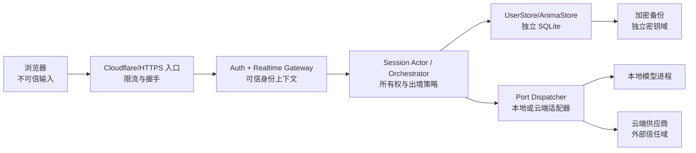

# VeyraSoul V2 用户数据隔离与 Anima 多实例设计

> **文档状态：匿名隔离与个性化纵切片已落地，可信多用户设计仍未完成、未部署。** 本文依据 `new_code` 当前代码进行审查，明确区分“匿名数据分区”“账号认证”和“待实现能力”。V1 继续独立运行；V2 在完成本文验收门槛前不得作为可信多用户服务上线。

## 1. 设计目标与安全不变量

V2 需要从“一个浏览器会话对应一份共享记忆”的开发原型，演进为可承载多个用户、每个用户多个 Anima 的隔离系统。以下不变量必须同时成立：

1. **认证身份不能由客户端声明。** `UserId` 只能来自服务端验证后的身份上下文；URL、JSON、WebSocket payload 和 `localStorage` 中的值均不能充当身份凭据。
2. **所有持久化访问先确定所有权，再打开存储。** 不能先按客户端提供的路径或 ID 打开文件，再在查询里补鉴权。
3. **用户之间物理分库；Anima 之间默认分库。** 通过数据库选择边界避免遗漏 `WHERE user_id = ?` 导致全库泄漏；不得建立跨用户向量库、FTS 表或内容去重池。
4. **Session 只能访问一个 `(UserId, AnimaId)`。** 切换 Anima 必须创建新 Session 或重新完成显式授权，不能在同一运行时对象上替换 ID。
5. **模型适配器无权读取数据库和任意文件。** 编排层只向 Port 传输经数据出境策略裁剪后的值；本地/云端切换不得扩大数据范围。
6. **程序、模型、配置、密钥、用户数据和派生缓存分开。** 更新或回滚程序不得覆盖用户数据；导出用户数据不得夹带程序密钥。
7. **删除、备份和恢复都是所有权敏感操作。** 导出/恢复前重新认证；删除同时撤销会话、停止推理、清理派生数据，并能证明备份保留策略已执行。
8. **日志和审计不记录内容。** 默认禁止记录对话正文、Anima.md、原始音频、图像、向量、API key、Cookie、Authorization header 和完整外部请求体。
9. **敏感生物特征默认仅本地处理。** 人脸模板、声纹、身份识别结果必须显式同意、独立加密、可单独删除；不能因本地模型失败而静默上传云端。
10. **任何失败都不能跨租户降级。** 数据库忙、迁移失败、云端超时或缓存未命中只能影响当前作用域；不得回退到全局库、默认用户或其他 Anima。

## 2. 当前实现审查（2026-07-13）

### 2.1 已有且可以保留的基础

| 能力 | 当前证据 | 结论 |
| --- | --- | --- |
| SQLite 参数绑定、事务和外键 | `backend/src/veyrasoul/memory/store.py` | 已在每 User/Anima 物理分库内复用。 |
| WAL、`busy_timeout=5000`、短连接 | `MemoryStore.connection()` 与 `_initialize()` | 是并发基础，不等于多用户隔离。 |
| 最近对话按 `session_id` 查询 | `store.py:142`、`gateway/runtime.py` | 匿名浏览器先按 session hint 派生物理分库；hint 仍不是认证凭据。 |
| 可取消 generation 与旧回复拒绝 | `orchestration/session.py`、`gateway/app.py` | 可作为每个 Session Actor 的并发基础。 |
| 记忆事实修订、证据来源、FTS5/可选向量召回 | `memory/curator.py`、`memory/retrieval.py`、`personalization/layout.py` | 存储与检索现由授权前置仍不可信的 identity scope 创建独立 Store；正式账号需 Auth Resolver。 |
| 匿名随机 ID 格式校验 | `web/src/core/realtime/sessionIdentity.ts` | 仅可作为非敏感“恢复提示”，不能作为认证。 |
| LLM、TTS、ASR、视觉、个性化已有 Protocol 抽象 | `orchestration/ports.py`、`perception/scheduler.py`、`personalization/ports.py` | 供应商 DI 边界已建立；仍需 `RequestScope`、出境策略和正式 provider registry。 |

### 2.2 当前会导致多用户泄漏或无法满足目标的缺口

| 编号 | 当前事实 | 风险/限制 | 状态 |
| --- | --- | --- | --- |
| C-01 | `SessionRegistry` 依据 `(UserId, AnimaId, session)` 创建 runtime，`DataLayout` 使用哈希目录和独立 `state.sqlite3`。 | 解决默认匿名浏览器之间的物理串库；不能替代认证或共享设备隔离。 | **匿名分区已实现** |
| C-02 | 默认 resolver 仅从 `?session/?anima` 构造匿名 identity，并拒绝任何显式 `?user=`；测试可注入 `client_asserted` resolver。 | 匿名 hint 泄漏仍会暴露同一匿名分区；可信账号、Origin 和对象授权尚未实现。 | **默认 fail-closed，正式鉴权未实现** |
| C-03 | 浏览器把匿名 session ID 写入 `localStorage` 并放入 URL（`sessionIdentity.ts:1-49`、`RealtimeClient.ts:218-223`）。 | XSS、浏览器扩展、URL 日志或共享设备可取得该值；当前虽注明“不作为认证”，服务端实际上仍据此恢复数据。 | **仅开发态** |
| C-04 | `memory_entries`、facts、FTS 和向量查询本身不含 user 列，但 Store 在打开数据库前已按 User/Anima 物理分区。 | 当前进程内检索不会跨库；未来远端向量库/共享缓存仍需强制 owner scope。 | **本地分库已实现** |
| C-05 | 全局 Persona 只作为新 Anima 默认值；`SqliteAnimaProfileStore` 持久化独立 `Anima.md`、设置与 revision。 | 还没有多 Anima CRUD、授权共享和账号级默认模板。 | **个性化纵切片已实现** |
| C-06 | 当前 schema 仅 `CREATE TABLE IF NOT EXISTS`，没有 schema 版本、迁移清单和恢复门槛。 | 无法安全升级大量独立数据库，也无法证明回滚可靠。 | **未实现迁移体系** |
| C-07 | 已有设置读写；仍没有凭据、Anima 所有权目录、导出、删除、备份、恢复或审计接口。 | 用户数据生命周期不完整。 | **部分实现** |
| C-08 | LLM/TTS/ASR/Vision/Profile 均有 Protocol/DI；仍没有 `RequestScope`、数据分级和统一 EgressPolicy。 | 能替换 adapter，但还不能证明云端出境范围或阻止未授权 fallback。 | **接口有、策略未实现** |
| C-09 | `perception.error` 与设置读写失败已改为稳定错误码和固定用户消息，日志只记录异常类型。 | 其他新增 adapter 仍需遵守相同规则，禁止把异常正文直传客户端。 | **当前切片已修复** |
| C-10 | systemd 目前以 `wenkang` 运行，数据路径也落在其 home。 | 程序、个人 home 与服务数据权限边界不清晰。 | **目标部署需重做** |

结论：当前 V2 已实现“不同稳定匿名 session 默认使用不同物理 Store”的开发态隔离，并通过匿名/显式用户交叉测试；它**不是可信账号认证，也不能宣称已支持安全多用户公网服务**。正式多用户仍受 Auth Resolver、对象授权、Origin/限流、数据生命周期和备份门槛阻断。

## 3. Threat model

### 3.1 需要保护的资产

- 账号凭据、登录会话、恢复凭据；
- 对话、长期事实、情节记忆、RAG 文档与检索结果；
- `Anima.md`、回复长度/延迟、音色、Live2D 角色和供应商选择等设置；
- 摄像头图像、麦克风音频、ASR 文本、视觉语义、面部/声纹模板；
- 本地/云端模型的 API key、Tunnel token、加密密钥；
- 备份、导出包、审计事件和迁移快照。

### 3.2 攻击者与误用场景

1. 未登录的公网访问者猜测或窃取 SessionId。
2. 已登录用户枚举其他 `UserId/AnimaId`，利用对象级鉴权遗漏读取/修改数据。
3. 恶意网页、XSS、浏览器扩展或共享设备读取 `localStorage`、摄像头画面和页面内状态。
4. 恶意 RAG 文档、对话或 Anima.md 注入指令，诱导模型泄漏系统 prompt、密钥或其他用户数据。
5. 配置错误导致本应本地处理的音频、图像、文档或生物特征被发送给云端供应商。
6. 云端模型供应商、代理或本地旁路服务被攻陷，记录请求或返回跨会话内容。
7. 开发板丢失、备份文件泄漏、服务账号或同机进程越权读取数据。
8. 并发、崩溃、迁移中断、断电或恢复到错误目录造成数据库混用或损坏。
9. 运维日志、错误响应、指标标签或 trace 记录敏感正文和可枚举 ID。

### 3.3 信任边界与非目标



- V2 应防止普通远程用户、其他租户、受限服务账号和误配置造成的数据串用。
- 若攻击者已经取得 root、运行中数据库解密密钥和进程内存，则应用层不能提供绝对保密；应由磁盘加密、系统补丁、物理管控和密钥轮换降低影响。
- 模型本身的“绝不幻觉”不属于隔离保证；但模型输出绝不能绕过对象授权、Port 出境策略或数据库边界。

## 4. 标识符与所有权关系

### 4.1 标识符定义

| 标识符 | 生成方 | 生命周期 | 是否是凭据 | 规则 |
| --- | --- | --- | :---: | --- |
| `UserId` | 服务端 | 账号/匿名主体生命周期 | 否 | 128 bit 以上不可预测 ID，例如 `usr_<uuidv7/随机>`；禁止自增公开 ID。 |
| `AnimaId` | 服务端 | Anima 生命周期 | 否 | `ani_<随机>`；恰好属于一个 User，默认不可跨用户共享。 |
| `SessionId` | 服务端 | 一次对话/实时连接，可短期恢复 | 否 | `ses_<随机>`；绑定一个 User、一个 Anima、一个设备/客户端和到期时间。 |
| `TurnId` | 服务端为主 | Session 内的一轮 | 否 | 只在绑定 Session 下唯一；客户端值只能作为幂等 hint，不能决定所有权。 |
| `CredentialSessionId` | 认证服务 | 登录态生命周期 | **是** | 只存于服务端；浏览器仅持有随机 HttpOnly Cookie，摘要落库。 |
| `StorageKey` | 服务端 | User/Anima 数据生命周期 | 否 | `HMAC(path-key, UserId/AnimaId)` 派生，不向客户端公开，不直接使用外部 ID 拼路径。 |

### 4.2 强制关系

```text
UserId 1 ── N AnimaId
UserId 1 ── N CredentialSessionId
(UserId, AnimaId) 1 ── N SessionId
SessionId 1 ── N TurnId
AnimaId 1 ── 1 AnimaStore
UserId 1 ── 1 AccountStore
```

每次请求构造不可变 `RequestScope`：

```text
RequestScope {
  principal_id, user_id, anima_id, session_id, turn_id?, generation?,
  consent_revision, adapter_policy_revision, correlation_id, deadline
}
```

`user_id` 必须由认证主体导出；`anima_id` 经过所有权校验后写入 scope；`session_id` 必须在服务端会话表中同时匹配前两者。任何一项不匹配均返回统一的 `not_found` 或 `forbidden`，不得尝试打开其他目录。

## 5. 程序、配置、密钥与数据完全分离

目标 Linux/ELF2 布局如下；Windows 开发机使用等价 ACL 和独立 data root，但生产边界以 Linux 为准。

```text
/opt/veyrasoul/
├── releases/<version>/           # 只读程序
├── current -> releases/<version> # 原子切换
└── models/<model-id>/            # 只读共享模型，不含用户数据

/etc/veyrasoul/
├── service.env                   # 非秘密运行配置，root 管理
├── policies/egress.yaml          # 数据出境策略
└── secrets.d/                    # 0600；服务 key/KEK，禁止进入导出和仓库

/var/lib/veyrasoul/
├── control/identity.sqlite       # 最小账号/认证/所有权目录
├── users/<shard>/<UserStorageKey>/
│   ├── account.sqlite
│   ├── animas/<AnimaStorageKey>/
│   │   ├── Anima.md
│   │   ├── anima.sqlite
│   │   ├── documents/            # 用户授权保存的源文档
│   │   ├── derived/              # 可重建的切块/向量/FTS 辅助文件
│   │   └── media/                # 默认不存在；显式开启且带 TTL
│   └── libraries/                # 可选的用户级知识库；禁止跨用户去重
└── audit/                        # 独立、追加式、安全事件

/var/cache/veyrasoul/             # 可删除的模型/推理缓存，不含长期事实
/run/veyrasoul/                   # socket、锁、临时会话，重启可丢弃
/var/backups/veyrasoul/           # 加密快照或上传前暂存，不与在线 DB 混用
```

要求：

- 目录使用 `0700`，数据库/Anima.md/文档使用 `0600`，服务 `UMask=0077`。
- 目标服务账号为专用 `veyrasoul`，不能继续依赖个人 `wenkang` home；程序只读、数据 root 可写。
- 路径解析只接受内部 `StorageKey`；拒绝 `..`、绝对路径、分隔符、符号链接、junction 和 hard-link 越界。
- 打开关键文件应使用等价于 `O_NOFOLLOW` 的安全方式，并验证解析后的父目录仍位于 data root。
- 共享模型目录不得含个人训练样本；由用户上传或克隆得到的音色属于用户数据，存入对应 Anima 目录。
- 原始音视频默认仅在内存的有界环形缓冲区中存在，推理完成或超时立即清除；保存必须由用户显式开启并显示保留期。

## 6. SQLite 分库与数据模型

### 6.1 Control DB：只保存最小身份目录

`control/identity.sqlite` 只允许 Auth/Directory 组件访问，建议包含：

- `users(id, kind, status, created_at, deleted_at, storage_key, key_ref)`；
- `credentials(user_id, type, password_hash/webauthn_ref, version)`；
- `credential_sessions(id_hash, user_id, expires_at, revoked_at, device_hash)`；
- `anima_directory(anima_id, user_id, storage_key, status, created_at)`；
- `anonymous_upgrade_jobs(source_user_id, target_user_id, state, idempotency_key)`；
- `deletion_jobs`、`backup_catalog`、`schema_migrations`。

该库不得存放对话、文档、视觉、声音、Anima.md 或供应商请求正文。密码只允许 Argon2id 等成熟 KDF；Cookie/token 只保存带 pepper 的摘要。

### 6.2 每用户 Account DB

`account.sqlite` 保存用户级偏好和非内容型元数据：

- locale、时区、无障碍偏好、默认 Anima；
- 数据出境同意及版本、保留期、导出/删除状态；
- 用户级文档库目录和对各 Anima 的显式挂载关系；
- 设置修订历史，但不保存服务 API key 明文。

### 6.3 每 Anima 独立 DB

`anima.sqlite` 是该 Anima 的唯一事实源，包含：

- `anima_settings`：回复最大字数、人工回复延迟、音色/语速、首选 Port、视觉/语音策略等；
- `persona_revisions`：Anima.md 的版本、摘要、时间和回滚指针；正文也可保存在文件中，DB 保存 hash；
- `sessions`、`turns`、`episodic_memories`、`facts`、`fact_evidence`；
- `documents`、`document_chunks`、`embeddings` 或向量索引引用；
- `consent_snapshots`、`retention_jobs` 和 Anima 范围内的操作记录。

数据库内仍应保存固定的 `store_meta(anima_id, user_storage_key_hash, schema_version)`。打开后必须与 Directory 返回的期望值恒定时间比较；不匹配立即关闭并告警。这是防御错误挂载，不替代目录授权。

### 6.4 RAG 隔离

- `HybridRetriever` 必须从已经授权的 `AnimaStore`/用户级 LibraryStore 创建，不能从进程级全局 `MemoryStore` 创建。
- FTS、向量候选、事实和最近对话不得跨 Anima 扫描；共享知识仅通过用户显式挂载的只读用户级库加入候选。
- 不做跨用户内容 hash 去重，因为命中/时序可形成侧信道；同一用户内可使用加密后的内容寻址。
- 召回结果携带 `store_id/document_id/chunk_id/revision`，提交到 prompt 前再次验证 scope。
- 恶意文档内容始终作为引用资料，不得提升为 system/developer 指令；Anima.md 也不能覆盖平台安全、工具权限或数据出境策略。
- embeddings 是用户数据。云端 embedding 需要独立同意；不能把不同用户的向量放入一个无访问过滤的 ANN 索引。

## 7. 并发、WAL 与会话一致性

每个 `anima.sqlite` 使用：

```text
PRAGMA journal_mode=WAL;
PRAGMA foreign_keys=ON;
PRAGMA busy_timeout=5000;
PRAGMA synchronous=NORMAL;       # 对话/派生记忆，性能模式
PRAGMA wal_autocheckpoint=1000;
```

身份、凭据、同意、删除状态和关键设置库使用 `synchronous=FULL`。若用户选择高耐久模式，Anima DB 也切换 `FULL`。`NORMAL` 的断电耐久取舍必须在设置和文档中明确，不能暗示零数据丢失。

并发策略：

1. 每个活跃 Anima 创建一个 `AnimaWriteCoordinator`，所有写操作进入有界队列；同一数据库只有一个应用级 writer。
2. embedding、LLM、ASR/VLM、文件 hash 等耗时工作在事务外执行；写事务只做校验和批量落库。
3. 关键状态使用 `BEGIN IMMEDIATE`；单次事务设置行数/时间上限，禁止在持锁期间等待网络。
4. 读连接按请求创建或从只读池取得，不跨线程复用；查询绑定 scope 对应的已打开 Store。
5. 多个 Session 可以同时访问同一 Anima：短期最近轮次仍按 Session 隔离，长期事实通过 writer 串行合并；generation 仍属于各 Session，不能设为 Anima 全局。
6. 活跃 Store 使用有界 LRU；淘汰前排空 writer、执行安全 checkpoint 并关闭所有连接。
7. 不把 SQLite/WAL 放在 SMB/NFS/Cloud Drive。Windows 开发机与 ELF2 都使用本地文件系统。
8. ELF2 单机优先一个 Gateway 进程维护 Actor/Store 所有权。若未来启用多 worker，必须先引入按 User/Anima 一致性路由或独立 Memory Service，不能让多个进程各自持有冲突的内存状态。
9. 备份不能直接复制正在写入的 `.db` 文件并漏掉 `-wal/-shm`；必须使用 SQLite Online Backup API 或 `VACUUM INTO` 的受控快照。

## 8. 认证、Session 与匿名用户升级

### 8.1 浏览器登录态

- 浏览器使用随机、短期、可轮换的 `HttpOnly; Secure; SameSite=Lax` Cookie；Cookie 只含不透明凭据，不含 UserId、密钥或 PII。
- 所有 cookie 鉴权的写接口必须验证 CSRF token；WebSocket 握手必须验证精确 Origin allowlist、Cookie 登录态、账号状态和速率限制。
- 非浏览器客户端使用短期 Bearer token；Authorization 不进入 URL、日志或 WebSocket query。
- `/v2/realtime` 的目标形态不再接受 `?session=` 作为身份。连接认证后，客户端发送 `animaId` 和可选 `resumeHint`；服务端校验所有权并返回新的/恢复后的 `SessionId`。
- `resumeHint` 可以作为非敏感值保存在浏览器，但必须被当作不可信输入；没有有效 CredentialSession 时不能读回任何对话。
- 登录、权限变化、匿名升级、密码修改和删除请求均轮换 Cookie 并撤销旧 Session。

### 8.2 匿名用户

匿名体验仍由服务端创建真正的匿名 `UserId` 和默认 `AnimaId`，并通过 HttpOnly 匿名 Cookie 绑定。限制建议：

- 7～30 天可配置 TTL、较低存储配额、默认本地推理、禁止生物特征持久化；
- Cookie 丢失时不允许仅凭旧 `localStorage` SessionId 找回内容；
- 过期匿名用户进入删除队列，按同一删除流程清理。

升级到正式账号必须在一个可重试的作业中完成：

1. 验证匿名 Cookie 和目标正式账号的新鲜认证；
2. 冻结匿名主体的新写入，撤销实时 Session；
3. 为目标用户生成新 StorageKey/数据密钥；
4. 复制或重新加密 Account/Anima stores，逐文件和逐表校验数量/hash；
5. 对同名 Anima/设置冲突给出明确选择，禁止静默覆盖；
6. 原子更新 Directory 映射，轮换 Cookie；
7. 将匿名目录置为 tombstone，完成保留期后安全删除；
8. 使用 idempotency key 保证断电重试不会产生两份“活动所有者”。

客户端传入的 `sourceUserId/targetUserId` 只能作为显示信息，真实源/目标必须来自两个已验证主体。

## 9. Anima 多实例与自定义设置

每个用户可创建多个 Anima。默认 Anima 不共享 persona、记忆、RAG、音色克隆、Live2D 私有资产或情感状态。

### 9.1 `Anima.md`

建议格式为带严格 front matter 的 UTF-8 Markdown：

```markdown
---
schema: v1
display_name: 草莓兔兔
language: zh-CN
---

# 核心人格
……
```

- 只允许服务端根据已授权 Anima 定位文件；API 不接受文件路径。
- 限制文件和各 section 大小、NFKC 规范化、拒绝 NUL；保存采用临时文件 + `fsync` + 原子 rename。
- 每次修改写 persona revision 和内容 hash；可回滚但不可篡改历史审计。
- 自定义人格是用户内容，不具有系统权限。平台安全规则、工具授权、数据边界和供应商策略位于不可覆盖的稳定前缀。

### 9.2 设置分层

```text
平台硬限制 > 用户同意/安全策略 > Anima 设置 > Session 临时覆盖
```

Anima 通用设置至少包括：

- 回复最大字数/token 上限；
- 回复延迟：默认 `0`，只能增加人为停顿，不能绕过服务 deadline；
- TTS voice id、语言、语速、音高；
- ASR、LLM、TTS、Vision、Embedding/Reranker 的 `local/cloud/disabled` 选择；
- 视觉语义更新频率、是否保存媒体、保留期；
- Live2D 模型/表情映射和无障碍偏好；
- 记忆写入等级、可用用户级知识库和云端出境同意。

客户端只发送白名单字段；voice/model 使用目录内逻辑 ID，不接受本地路径或任意 URL。所有设置更新都做版本检查（optimistic concurrency）和审计。

## 10. 所有模态 Port/API 与本地/云端切换

### 10.1 统一契约

目标 Port 至少覆盖：

- `StreamingAsrPort`
- `VisionSemanticPort`
- `FaceIdentityPort` / `SpeakerIdentityPort`
- `StreamingLlmPort`
- `SpeechSynthesisPort`
- `EmbeddingPort` / `RerankerPort`
- `AvatarIntentPort`（通常本地）
- `ActionPort`（未来板端设备动作）

每个调用由编排器持有 `RequestScope`，但 Adapter 只能收到 `EgressEnvelope`：

```text
EgressEnvelope {
  provider_request_id, modality, classification,
  payload, deadline, retention_hint, consent_revision
}
```

Dispatcher 的顺序必须是：

1. 由已授权 Anima 设置选择 Port；
2. 计算数据分类和允许的字段；
3. 验证当前同意版本、供应商能力、区域和保留策略；
4. 生成不含 UserId/AnimaId/SessionId 的 provider request ID；
5. 仅把裁剪后的 envelope 交给 Adapter；
6. 返回结果时验证 scope/generation 仍有效，再写入当前 AnimaStore。

Adapter 不得接收 `MemoryStore`、数据库连接、用户根路径或 API 中未声明的上下文。切换供应商通过配置和 capability registry 完成，不允许业务代码读取任意 endpoint 或动态导入未签名模块。

### 10.2 各模态最小出境原则

| 模态 | 本地默认 | 云端允许的最小数据 | 禁止行为 |
| --- | --- | --- | --- |
| ASR | 是 | 用户明确开启后发送当前语音片段；端点结束立即释放 | 不上传摄像头、历史记忆或身份 ID；不保留原始录音 |
| Vision/VLM | 是 | 显式开启后发送降采样/裁剪/必要时打码的当前帧 | 不把 60 FPS 预览当上传流；失败时不静默转云端 |
| 人脸/声纹 | 本地且默认禁持久化 | 默认不允许；若将来支持需单独的高敏同意 | 不与普通视觉/ASR 同意混用，不进入共享向量库 |
| LLM | 可选 | 有界的当前文本、必要视觉语义、经 scope 验证的少量记忆 | 不发送数据库 ID、路径、API key、无关文档和其他 Anima 内容 |
| TTS | 本地优先 | 仅发送即将播报的生成文本与非识别性 voice id | 不发送用户原始音频、RAG 文档、完整对话历史 |
| Embedding/Rerank | 本地优先 | 单个裁剪后的文档 chunk/查询，需独立同意 | 不把 metadata、用户 ID 或不同用户批次混在一起 |
| Avatar/Action | 本地 | 原则上无云端数据需求 | 不让模型输出直接取得文件、网络或硬件权限 |

策略还必须规定：

- 本地失败默认 fail closed；云端 fallback 只有用户明确选择且当次同意仍有效时才发生。
- Provider client 使用独立连接池、超时、并发配额和 circuit breaker；缓存 key 必须包含 Adapter + 模型版本 + 用户/Anima 隔离域，或完全不缓存敏感请求。
- 上游错误映射为稳定错误码；不得向浏览器透传 Python 异常、文件路径、完整供应商响应或认证信息。
- 远端请求只经 TLS，禁止关闭证书校验；本地模型端口只监听 loopback/Unix socket，并限制到专用服务账号。
- 云端供应商的“零保留”声明不能替代本项目自己的最小化和审计；供应商切换要重新评估数据类别。

### 10.3 API 面与 Adapter 注册

“保留 API”不等于让浏览器直接调用任意模型地址。建议分成三层：

1. **用户 API**：`/v2/animas`、`/v2/animas/{id}/settings`、`/v2/animas/{id}/documents`、`/v2/exports`、`/v2/deletions`，统一走 Auth/ownership dependency 和显式响应 schema。
2. **实时 API**：`/v2/realtime` 只承载已授权 Session 的音频、图像、文字和 Avatar 事件；客户端不能在 payload 中指定 provider URL、数据库路径、UserId 或密钥。
3. **内部模态 API**：当 Adapter 独立进程化时，为 ASR、Vision、Face/Speaker、LLM、TTS、Embedding/Rerank、Avatar/Action 提供版本化的 loopback/Unix-socket HTTP/gRPC 契约。只有 Port Dispatcher 可调用；公网入口不路由 `/internal/*`。

每个 Adapter 通过静态 allowlist 注册 `adapter_id/version/modality/locality/capabilities/data_classes/retention_policy/health`。Anima 设置只保存 `adapter_id`，不保存实现类、动态模块名、URL 或 key。替换本地/云端实现时保持 Port 请求/响应契约不变，先做 capability 与数据策略匹配，再原子切换注册表 revision；已经开始的 Session 继续使用其快照，不能在一轮中途换供应商导致数据范围变化。

内部 API 即使只监听 loopback，也要限制 payload 大小、deadline、并发和调用身份；未来跨主机时使用 mTLS/工作负载身份。响应必须带 `provider_request_id` 和模型/Adapter 版本，但不得回显用户标识或内部路径。每个模态都要有 contract test，同一组测试同时运行本地 fake、本地真实和云端 mock Adapter，证明可替换性不是仅有 Protocol 声明。

## 11. 密钥边界与最小权限

### 11.1 密钥类别

- **服务级 Provider key**：位于 `/etc/veyrasoul/secrets.d` 或系统凭据服务，仅 Adapter Broker 可读。
- **路径派生 HMAC key**：只用于生成 StorageKey，独立于数据库加密 key。
- **用户数据密钥 DEK**：每用户独立；由设备 KEK 包装，控制库只保存 `key_ref/wrapped_key`。
- **备份密钥**：与在线数据 key 分离；备份包用随机 DEK 加密，再由离线/远端接收方公钥包装。
- **用户自带 key（未来）**：只保存加密封装或凭据代理引用，不写入 Anima DB、日志、导出包或前端 localStorage。

SQLite 社区版不提供透明加密。目标生产至少需要磁盘加密 + 加密备份；若要求“删除备份后立即不可恢复”或抵抗离线文件窃取，应引入经验证的 SQLCipher/等价方案和每用户 DEK。该能力**当前未实现**，不能只通过文件权限宣称静态加密。

### 11.2 服务最小权限

目标 systemd 单元应使用专用用户并收紧：`ProtectSystem=strict`、`ProtectHome=true`、`ReadWritePaths=/var/lib/veyrasoul /var/cache/veyrasoul /run/veyrasoul`、`NoNewPrivileges=true`、`PrivateTmp=true`、`UMask=0077`、`RestrictSUIDSGID=true`。是否启用 `PrivateDevices` 取决于模型进程是否直接访问 NPU/摄像头；Gateway 浏览器采集模式本身不需要设备节点。

模型 worker、Gateway、Backup Agent 和 Auth/Key Broker 应使用不同服务身份：

- Gateway 无权读取明文 provider key，只能调用 Broker 或读取对应最小 key；
- 模型 worker 无权遍历用户目录；
- Backup Agent 只读受控快照，无权登录用户 API；
- Web 静态进程无权读数据库和 secrets。

## 12. 导出、删除与数据保留

### 12.1 用户导出

导出是异步、幂等、需新鲜认证的作业。导出包按用户生成，不允许传入任意源目录：

```text
manifest.json            # schema/app version、时间、文件 hash、Anima 列表
account/settings.json
animas/<AnimaId>/Anima.md
animas/<AnimaId>/settings.json
animas/<AnimaId>/turns.jsonl
animas/<AnimaId>/memories.jsonl
animas/<AnimaId>/documents/...
README.txt
```

- 默认不导出 provider key、Cookie、密码 hash、内部 StorageKey、审计系统的其他主体、可重建缓存、原始生物特征模板。
- 若用户单独请求生物特征导出，需再次确认并使用单独加密包。
- 导出文件使用随机一次性下载 token，短期过期、单次使用；HTTP 响应禁止公共缓存。
- 导出完成后 staging 按 TTL 清除；审计只记录 job id、类别和字节数，不记录内容。

### 12.2 删除

删除用户/Anima 的顺序：

1. 新鲜认证 + 二次确认，写 `deletion_job`；
2. Directory 状态改为 `deleting`，拒绝新连接；
3. 撤销 Cookie/Bearer、停止所有 Session Actor、取消 ASR/VLM/LLM/TTS、清空发送队列；
4. checkpoint/关闭 DB，删除 DB、`-wal/-shm`、Anima.md、文档、向量、媒体、缓存、导出 staging；
5. 撤销/销毁用户 DEK；
6. 将备份目录加入 purge/crypto-erasure 清单并等待远端确认；
7. Directory 只保留不含 PII 的 tombstone 与删除证明，防止旧作业复活用户；
8. 审计记录完成状态，不保留对话或明文 UserId（使用带轮换 salt 的审计主体摘要）。

文件删除不能承诺在 SSD/eMMC 上物理覆写成功；可靠策略是加密存储后销毁 DEK，并执行备份保留/删除协议。未实现 per-user encryption 前，必须诚实标注删除的物理介质限制。

## 13. Schema migration

每个 SQLite 文件维护：

```sql
schema_migrations(version INTEGER PRIMARY KEY, name TEXT, sha256 TEXT,
                  applied_at_ms INTEGER, app_version TEXT);
```

迁移流程：

1. 校验数据库 `store_meta`、文件所有者、路径和当前版本；
2. 拒绝未知的更高版本，不能用旧程序“尽力打开”；
3. checkpoint 并通过 SQLite Online Backup API 创建迁移前快照；
4. 获取该 Store 的迁移锁，停止新 Session 写入；
5. 校验迁移文件 hash，在事务内执行一个版本；大表重建使用新表复制/校验/rename；
6. 运行 `foreign_key_check`、`quick_check/integrity_check`、行数和 owner metadata 校验；FTS/派生索引按版本重建；
7. 成功后原子更新 Directory 中的版本；失败关闭 Store，并从快照恢复，不允许回退到空库；
8. 批量升级按用户/Anima 小批次执行，支持暂停和幂等重试。

不依赖 down migration 回滚用户数据。回滚程序必须使用迁移前快照或明确支持 N/N-1 schema 的版本。测试必须注入“迁移中断电”和重复执行。

当前共享 `veyrasoul.db` 没有可信 UserId/AnimaId，**不能自动按 session 字符串推断所有者并拆分**。若其中仅为开发测试数据，应归档后从空的分区存储启动；若确有需要保留的单用户数据，必须由管理员明确指定一个 legacy User/Anima，在离线迁移中整体导入并生成审计报告。任何归属不明的数据都进入隔离 quarantine，不能被任意新账号继承。

## 14. 备份、恢复与灾备

### 14.1 备份

- 使用 Online Backup API 对 `identity.sqlite`、`account.sqlite`、每个 `anima.sqlite` 生成一致快照；Anima.md/文档先进入只读 revision，再连同 manifest 打包。
- 每个包包含 schema version、app version、scope、文件 size/hash、创建时间、基线/增量关系；manifest 本身签名。
- 先使用随机 DEK 做 AEAD 加密，再用备份接收方公钥/KEK 包装；数据包和解密 key 不放在同一位置。
- 保留至少 3 代、2 种介质、1 份离板副本；断网时本地排队，恢复网络后续传，不因上传失败阻塞对话。
- 派生向量/FTS 可以排除以降低体积，但源文档、切分参数、embedding 模型版本必须存在，以便确定性重建。
- 每次备份执行 hash 验证；每月至少自动抽样恢复，每个发布候选做一次完整恢复演练。

建议目标（尚未验证）：身份/同意/设置 RPO ≤ 15 分钟，Anima 对话与记忆 RPO ≤ 1 小时，单用户恢复 RTO ≤ 30 分钟，整板灾备 RTO ≤ 4 小时。实际值必须由 ELF2 压测和断网场景确认。

### 14.2 恢复

恢复绝不能直接覆盖在线目录：

1. 在隔离 staging 解密并验证签名/hash、scope、schema 和恶意路径；
2. 用受限 SQLite 打开，执行完整性、外键、owner metadata 和计数检查；
3. 必要时在 staging 迁移到当前 schema；
4. 与现有 User/Anima 冲突时选择“覆盖（先快照）/新建副本/取消”，禁止隐式合并事实历史；
5. 停止目标 Store writer，原子 rename 切换；
6. 重新生成 StorageKey/DEK、撤销旧 Session，重建派生索引；
7. 运行最小读写/RAG smoke test 后才标记成功。

灾备恢复时，程序 release、模型和用户数据分别恢复；恢复用户数据不应要求恢复旧仓库工作树，也不能把 V1 覆盖为 V2。

## 15. 审计与隐私可观测性

应记录的安全事件：

- 登录成功/失败、Cookie/token 轮换和撤销；
- Session 创建/恢复/断开及 Anima 所有权拒绝；
- Anima 创建/删除、Anima.md 与关键设置 revision；
- 云端数据出境：模态、供应商、数据分类、字节数、同意版本、结果码、耗时；
- 导出、删除、备份、恢复、迁移的状态；
- Store metadata 不匹配、路径/符号链接拒绝、跨租户访问尝试、完整性检查失败。

禁止记录：prompt/回复正文、ASR/VLM 原文、原始音视频、文档 chunk、embedding、Anima.md、Cookie/Authorization、API key、绝对用户路径。日志使用 `correlation_id` 和带轮换 salt 的主体摘要；高基数 UserId/SessionId 不作为 metrics label。审计库与业务库分开、追加式写入、权限只写不可改，设置明确保留期和容量上限。

## 16. 实施顺序与当前完成度

### P0：多用户上线阻断项

1. **部分完成：**服务端 UserId/AnimaId/SessionIdentity 已有；Auth/Directory 和移除 query/localStorage 认证歧义未完成。
2. **部分完成：**`DataLayout`、每 User/Anima 分库已完成；可信所有权验证和旧全局 facts 人工迁移未完成。
3. **开发态完成：**RAG/事实/最近轮次从 scope Store 创建，并有匿名/显式用户交叉测试；仍需认证后对象授权测试。
4. **部分完成：**内部感知/设置异常已使用稳定错误码；WebSocket Origin/鉴权/限流仍未完成。二进制/设置请求已有大小与类型限制，但还不是完整网关策略。

### P1：产品完整性

1. **部分完成：**`Anima.md` revision、回复字数/延迟/音色已完成；多 Anima CRUD 与 provider 选择未完成。
2. 匿名主体、升级事务、账号/Anima 导出和删除。
3. Per-Anima writer、WAL checkpoint、LRU Store 生命周期。

### P2：可运维性与供应商切换

1. **部分完成：**核心模态 Port 已建立；`RequestScope`、EgressPolicy、云端同意和 provider registry 未完成。
2. schema migration runner、加密备份/恢复、审计与隐私指标。
3. 专用系统用户、程序/数据/密钥目录和 systemd 最小权限。

### P3：增强保护

1. 每用户 DEK/SQLCipher（或经评审的等价方案）、密钥轮换和加密删除。
2. 生物特征独立 vault、权限和删除流程。
3. 多进程/多节点一致性路由（只有需要横向扩展时实施）。

**截至本文日期，P0～P3 仍均未完整完成。** 已完成的是匿名物理分区、个性化设置和核心 Port 纵切片；认证、对象授权、完整生命周期、出境策略与可恢复备份仍是发布阻断项。

## 17. 验收测试与发布门禁

### 17.1 身份与对象授权

- 创建 U1/A1、U1/A2、U2/A3；对所有 REST/WS 资源执行 ID 互换，跨所有者请求必须一致拒绝且不产生侧向信息。
- 仅持有 U1 的 `resumeHint/SessionId`，没有 U1 有效 Cookie/Bearer 时，无法读取任何数据。
- U1 已登录但请求 U2 的 AnimaId、导出 job、备份或设置时必须失败；不能打开 U2 数据库。
- WebSocket 非 allowlist Origin、过期/撤销 Cookie、冻结/删除用户均在 `accept` 前拒绝。

### 17.2 存储与 RAG 隔离

- 在三个 Anima 写入相同检索词和互相矛盾的秘密；FTS、向量、事实、recent turns 的结果只能来自当前 scope。
- Monkeypatch/spy 证明每个请求只打开预期 `UserStorageKey/AnimaStorageKey`；`../`、绝对路径、symlink/junction/hard-link 全部被拒绝。
- 对 1000 个随机 UserId/AnimaId 做属性测试，任意 API 返回集合都是调用者授权集合的子集。
- 任何数据库缺失/损坏/忙碌时 fail closed，不能创建默认共享库或改查全局路径。

### 17.3 并发、崩溃与性能

- 同一 Anima 2～8 个 Session 并发写至少 10,000 轮/事实，验证无重复 turn、无丢失 revision、FTS 与主表一致。
- 多用户同时检索时 p95 不因全库规模线性增长；每个 Store 的检索 deadline 仍满足项目 SLO。
- 在写事务、checkpoint、迁移、匿名升级、导出和备份各阶段注入进程 kill/断电，重启后 `integrity_check` 通过且所有权不改变。
- WAL 达到阈值能 checkpoint；LRU 淘汰后无未关闭连接和孤立 `-wal/-shm`。

### 17.4 匿名升级、导出、删除与灾备

- 匿名升级重复调用、半途失败和同名 Anima 冲突均幂等；升级后旧匿名 Cookie/Session 失效。
- 导出 U1 后对包内容和 manifest 做 allowlist，证明没有 U2 数据、密钥、内部路径、缓存或日志正文。
- 删除 A1/U1 后在线 DB、WAL、文档、向量、媒体、staging、缓存和 Session 全部不可访问；备份 purge/DEK 撤销有可验证记录。
- 从最近三代备份分别恢复到隔离目录，通过 hash、owner、schema、RAG 和最小对话 smoke test；旧版本 schema 能按受控路径迁移。

### 17.5 Port 与数据出境

- 用 recording fake adapter 捕获每个模态 envelope，断言不含 UserId/AnimaId/SessionId、路径、key 或非必要记忆。
- 对每种 `local/cloud/disabled` 策略、同意撤销、供应商失败和超时做矩阵测试；未同意时云端调用计数必须为 0。
- 本地 Vision/ASR/生物特征失败时不得触发静默云端 fallback。
- 返回旧 generation、错误 Session 或延迟响应的恶意 Adapter 不能写入 Store 或发送给前端。

### 17.6 日志、秘密与系统权限

- 自动扫描日志/trace/审计/错误响应，注入的金丝雀 prompt、API key、Cookie、图像 hash 和文档正文不得出现。
- 服务账号无法写 `/opt/veyrasoul`、读取无关 home 或访问其他 User store；Backup/Model/Web 进程权限按矩阵验证。
- 备份文件和遗失 data root 在没有 KEK/接收方私钥时不能解密；密钥轮换后新旧版本恢复符合策略。

### 17.7 发布结论

只有当以上测试在 Windows 开发环境、ELF2 本地文件系统和真实 HTTPS/WSS 入口均有可复现报告，并且 P0 全部通过，才允许将 V2 标记为“支持多用户”。P1/P2 对正式公开服务同样是发布门槛；在此之前 V1 继续运行，V2 不部署到开发板或评委站点。
