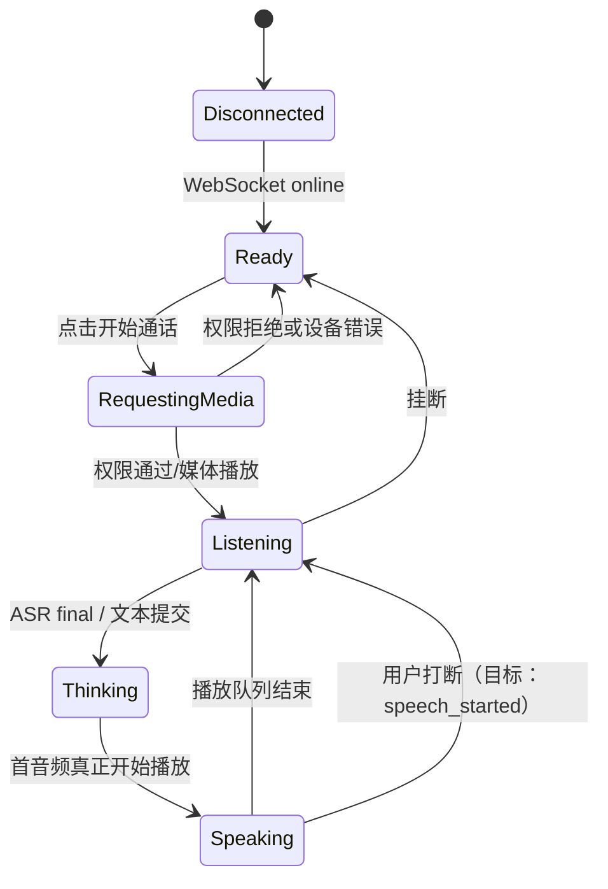

# 视频通话式 UX 设计与实现边界

## 1. 体验目标

界面应让用户感觉自己正在与一个持续在线、能看见和听见自己的角色通话，而不是向一组独立 AI 工具提交任务。

核心反馈顺序：

1. 点击“开始陪伴通话”；
2. 浏览器一次性请求摄像头和麦克风权限；
3. 用户立即在画中画中看到本地预览；
4. 角色进入倾听状态，ASR partial 提供正在听见的反馈；
5. 角色回复时，首段音频与同段文字同步出现；
6. 麦克风、摄像头和挂断始终在拇指/鼠标易达区域；
7. 新发言可打断旧回复，不出现旧音频和旧文字“复活”。

## 2. 三种不同的“帧率”

不得把本地预览、视觉关键帧和语义刷新混为一个设置。

| 数据面 | 当前/目标频率 | 用途 | 是否经过网络 |
| --- | ---: | --- | :---: |
| 本地摄像头预览 | 请求最高 60 FPS | 用户看到自己、确认镜头 | 否 |
| JPEG 视觉关键帧 | 当前目标 2 Hz（500 ms） | 板端快视觉输入 | 是 |
| Qwen/VLM 场景语义 | 目标最短 5 秒一次 | 背景、人物状态和关系语义 | 不单独传原视频 |
| Live2D 渲染 | 目标 60 FPS | 角色生命感 | 否（参数事件低频到达） |

“语义改为 5 秒一次”绝不意味着摄像头每 5 秒刷新。当前 `<video>` 直接消费 `MediaStream`；采样器只偶尔复制当前帧，因此视觉推理慢也不应拖住本地预览。

实际摄像头可能协商为 30 FPS。产品应把 60 FPS 当作可测目标，而不是仅凭 `getUserMedia` constraint 宣称达成。

## 3. 当前媒体实现

### 摄像头

- `facingMode: user`，理想/最大 1280×720、60 FPS；
- `<video muted playsInline>` 提供低延迟本地画中画；
- `VideoSampler` 500 ms 定时、最大宽度 384、JPEG quality 0.56；
- 优先 `createImageBitmap + OffscreenCanvas`，fallback 复用普通 canvas；
- idle 调度、busy 门和关闭摄像头时停止 sampler；
- 关闭摄像头会 disable video track，不影响麦克风。

### 麦克风

- 请求 echo cancellation、noise suppression、auto gain control 和 mono；
- AudioWorklet 将浏览器采样率重采样为 16 kHz；
- 每帧 320 个 int16 samples，即 20 ms PCM16；
- 音频通过 VSR2 binary frame 上传，不做 Base64；
- 关闭麦克风会 disable audio track，保持会话本身在线。

当前前端仍有一个没有绑定行为的旧语音圆形按钮，应在产品化阶段删除或明确成“按住说话”；通话模式的主要麦克风控制以底部通话栏为准。

## 4. 通话状态机

当前代码有 `idle/listening/thinking/speaking` UI 状态，但尚未实现完整的 VAD `speech_started` 状态机：语音 final 会启动新轮并取消旧轮，不能做到用户一开口的数十毫秒内就打断。

## 5. 文字、声音与动作同步

本项目明确不采用“前端先显示全文、TTS 后跟上”。当前同步点是**每段音频开始播放**：

- 服务端仅在 TTS 生成该句音频后发送配对事件；
- 下行音频 binary 先到，JSON 通过 `audioSeq` 引用；
- 前端 AudioSegmentQueue 顺序播放；
- `HTMLAudioElement.play()` 成功时才向 UI 暴露同段文字；
- `reply.completed` 在前端等待播放队列清空后再传播。

Live2D 已按实际 WAV 的 20 ms RMS 包络和 `audio.currentTime` 驱动连续口型，且与文字开始显示共享同一个 `playing` 边界。仍待实现的是：让后端 AvatarIntent 与相同 generation/segment index 绑定，并把 viseme、语义重音和动作时间轴对齐，而不是在整段回复前随机启动一个 motion。

## 6. PC 优先，移动端功能完整

### PC 宣传视图

- Live2D 舞台是最大视觉主体；
- 摄像头预览使用不遮挡脸部的画中画；
- 顶部仅保留品牌、通话时长、连接状态和控制台入口；
- 对话卡、输入框和通话控制在屏幕底部形成稳定操作区；
- 高级设置/日志进入 drawer，普通界面不展示原始 JSON。

### 移动端

- 保留开始/挂断、麦克风、摄像头、文本输入、画中画和状态反馈；
- 使用 `env(safe-area-inset-*)` 规避刘海、圆角和底部手势条；
- 控件最小触达尺寸、文字换行、横竖屏和软键盘顶起需要真机验证；
- drawer 在后续应转成 bottom sheet；当前主要完成响应式尺寸与布局，不等于全浏览器兼容已验收。

## 7. 权限、隐私和失败反馈

- 手机/公网必须 HTTPS；不安全来源通常无法使用 `getUserMedia`；
- 权限必须由用户手势触发，不能页面加载时静默打开；
- 预览始终 muted，避免本机回声；
- 媒体获取失败在界面显示可读错误，不把异常堆栈暴露给用户；
- 摄像头/麦克风开关直接作用于 track；挂断停止 sampler、AudioContext 和所有 tracks；
- 当前 Gateway 未实现用户鉴权和媒体加密之外的应用层访问控制，正式公网发布前必须补齐。

## 8. 验收清单

1. 本地预览实际 FPS、掉帧和主线程 long task 有统计；
2. 开启 2 Hz JPEG 采样后，本地预览 FPS 不显著下降；
3. 5 秒语义推理期间预览、ASR 和 TTS 不被阻塞；
4. PC Chrome/Edge 和至少两种 Android 浏览器完成权限、前后台、旋转、锁屏恢复测试；
5. 弱网时媒体队列有界，旧帧不会积压；
6. 挂断后摄像头指示灯、音轨、AudioContext 和 WebSocket 任务按设计释放；
7. 新发言后旧音频、文字、Live2D 动作和记忆提交全部失效；
8. 视觉摘要来自与当前画面匹配的新鲜快照，不生成“画面中有 1 人”等生硬检测日志式回答。
